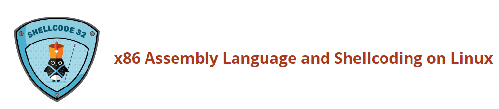

# Securitytube Linux Assembly Expert 32-bits

This course focuses on teaching the basics of 32-bit assembly language for the Intel Architecture (IA-32) family of processors on the Linux platform and applying it to Infosec. Once we are through with the basics, we will look at writing shellcode, encoders, decoders, crypters and other advanced low level applications.

---------------------------------------------------

## [Assignment #1](https://github.com/ricardojoserf/slae/tree/master/a1_Shell_Bind_Tcp)

- Create a Shell_Bind_TCP shellcode

	- Binds to a port

	- Execs Shell on incoming connection

- Port number should be easily configurable

---------------------------------------------------

## [Assignment #2](https://github.com/ricardojoserf/slae/tree/master/a2_Shell_Reverse_Tcp)

- Create a Shell_Reverse_TCP shellcode

	- Reverse connects to configured IP and Port

	- Execs Shell on successful connection

- IP and Port number should be easily configurable

---------------------------------------------------

## [Assignment #3](https://github.com/ricardojoserf/slae/tree/master/a3_Egg_Hunter)

- Study about the Egg Hunter shellcode

- Create a working demo of the Egghunter

- Should be configurable for different payloads

---------------------------------------------------

## [Assignment #4](https://github.com/ricardojoserf/slae/tree/master/a4_Custom_Encoder)

- Create a custom encoding scheme like the "Insertion Encoder" we showed you

- PoC with using execve-stack as the shellcode to encode with your schema and execute

---------------------------------------------------

## [Assignment #5](https://github.com/ricardojoserf/slae/tree/master/a5_Shellcode_Functionality)

- Take up at leat 3 shellcode samples created using Msfvenom for linux/x86

- Use GDB/Ndisasm/Libemu to dissect the functionality of the shellcode

- Present your analysis

---------------------------------------------------

## [Assignment #6](https://github.com/ricardojoserf/slae/tree/master/a6_Polymorphism)

- Take up 3 shellcodes from Shell-Storm and create polymorphic versions of them to beat pattern matching

- The polymorphiv versions cannot be larger 150% of the existing shellcode

- Bonus points for making it shorter in length than original

---------------------------------------------------

## [Assignment #7](https://github.com/ricardojoserf/slae/tree/master/a7_Custom_Crypter)

- Create a custom crypter like the one shown in the "crypters" video

- Free to use any existing encryption schema

- Can use any programming language

---------------------------------------------------

## Note

This blog post has been created for completing the requirements of the SecurityTube Linux Assembly Expert certification: https://www.pentesteracademy.com/course?id=3

Student ID: SLAE - 1433
