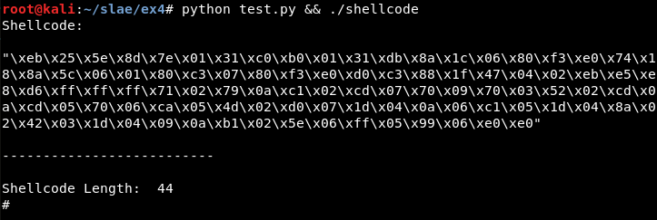
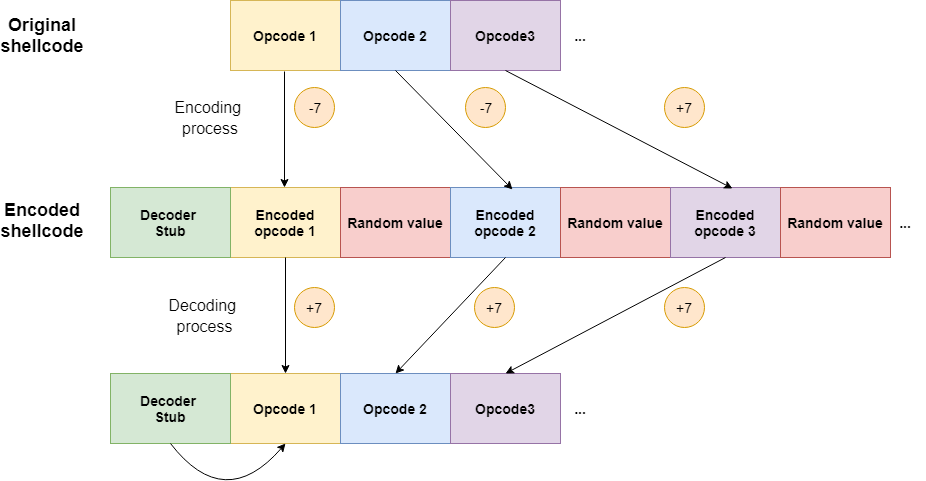
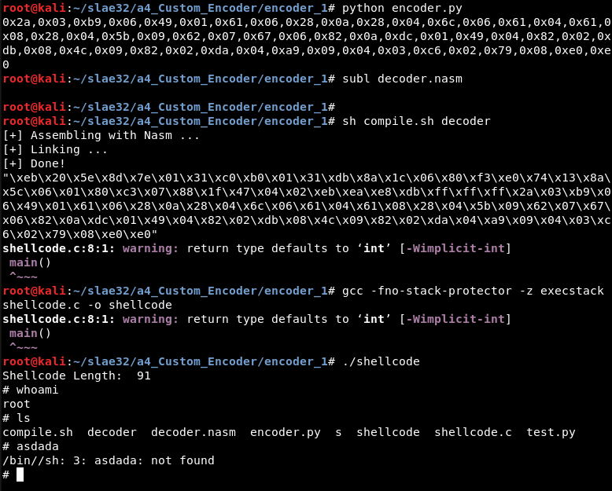
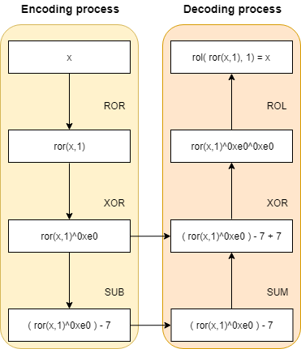
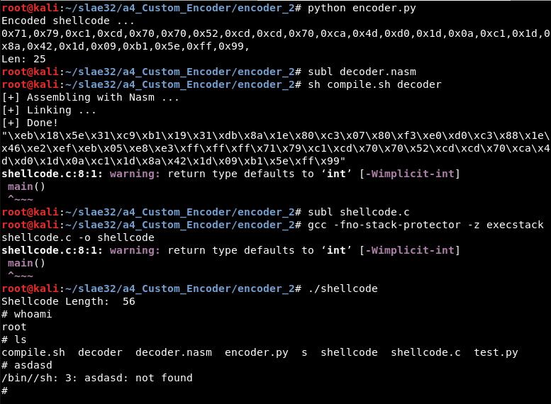

# Assignment #4: Custom encoding schema

- Create a custom encoding scheme like the "Insertion Encoder" we showed you

- PoC with using execve-stack as the shellcode to encode with your schema and execute


---------------------------------------------------


## Usage

For this assignment, a Python script has been created which generates the shellcode, updates and compiles the *decoder.nasm* file and updates and compiles the *shellcode.c* file, generating the final executable:

```
python test.py  && ./shellcode
```




## Motivation

The motivation to create custom encoding algorithms is to be able to beat pattern matching and bypass AVs. For this exercise, we start from the "Insertion" and "NOT" encoder algorithms from the course, update both ideas and create two new encoding algorithms.


---------------------------------------------------


### Encoding 1: Random inserted opcodes

In this algorithm, there will be fake opcodes inserted between every correct opcode as in the "Insertion" encoder but, in this case, the values will be randomized. This will cause that the shellcode is different every time the program is run: 



The value to verify the shellcode has finished will be calculated in the Python script, an unused value between the minimum and the maximum of the opcode values of the shellcode. For example, in the case of the "execve" shellcode, this value is "\xe0".

Furthermore, the correct opcodes will be encoded with a sum operation, adding 7 to the value during the encoding process and substracting 7 during the decoding.

To verify it is correct, it can be tested using the test script or step by step, as shown in the next picture. The encoder Python script is executed, the output updates the *EncodedShellcode* variable of *decoder.nasm* value, and the .nasm file is compiled. Then, the executable can be created after updating the *shellcode.c* file and compiling it using gcc:




---------------------------------------------------


### Encoding 2: Opcodes encoding

There will be 3 operations to encode every opcode: a ROR operation with the value 1 ("rotating" the bits once towards the "right"), a XOR with *0xe0* and a substraction with the value 7. 

Thereby, the decoding function will first add the value 7, then XOR the value with *0xe0* and finally do the ROL operation with the value 1 ("rotating" the bits once towards the "left").

This can be understood better with the next picture:



To verify it is correct, it can be tested using the test script or step by step, as shown in the next picture. The encoder Python script is executed, the output updates the *EncodedShellcode* variable of *decoder.nasm* value, and the .nasm file is compiled. Then, the executable can be created after updating the *shellcode.c* file and compiling it using gcc:




---------------------------------------------------

## Note

This blog post has been created for completing the requirements of the SecurityTube Linux Assembly Expert certification: https://www.pentesteracademy.com/course?id=3

Student ID: SLAE - 1433
