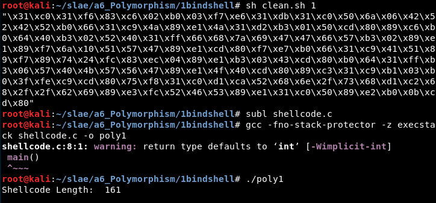
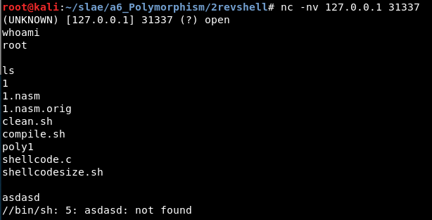
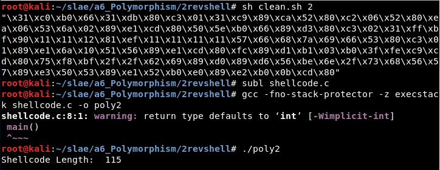
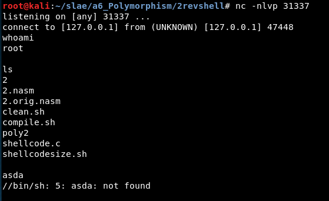
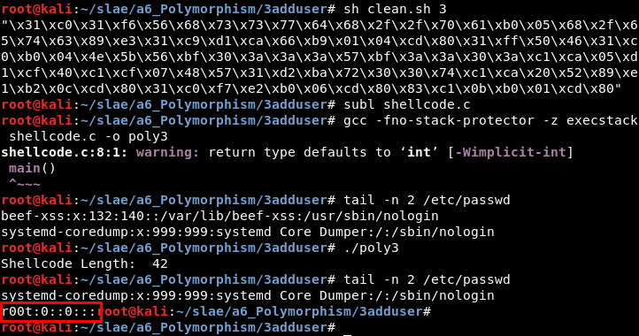

# Assignment #6: Polymorphic shellcodes

- Take up 3 shellcodes from Shell-Storm and create polymorphic versions of them to beat pattern matching

- The polymorphic versions cannot be larger 150% of the existing shellcode

- Bonus points for making it shorter in length than original

---------------------------------------------------

## Motivation

The polymorphic version of a shellcode keeps the same functionality of the original code. However, the opcodes are different so if the process is done correctly it is possible to beat pattern matching and bypass AVs. In this assignment three shellcodes from Shell-storm will be updated and the opcodes will differ for almost every line, but the code will work as before.

---------------------------------------------------

## 6.1 Shellcode "TCP Bind Shell" 

Original size: 	108 bytes

Final size: 	161 bytes (149 %)

Url: http://shell-storm.org/shellcode/files/shellcode-847.php

---------------------------------------------------

## 6.2 Shellcode "TCP Reverse Shell"

Original size: 	89 bytes

Final size: 	115 bytes (129 %)

Url: http://shell-storm.org/shellcode/files/shellcode-849.php

---------------------------------------------------

## 6.3 Shellcode "Add user r00t in /etc/passwd"

Original size: 	69 bytes

Final size:		99 bytes (143 %)

Url: http://shell-storm.org/shellcode/files/shellcode-211.php

---------------------------------------------------

## Note

This blog post has been created for completing the requirements of the SecurityTube Linux Assembly Expert certification: https://www.pentesteracademy.com/course?id=3

Student ID: SLAE - 1433
