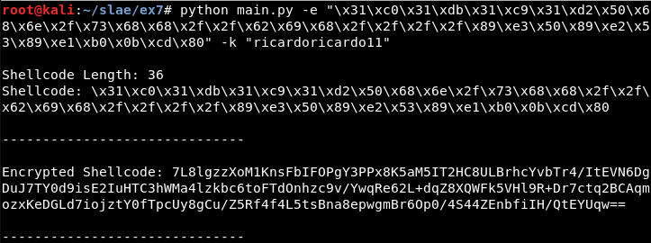
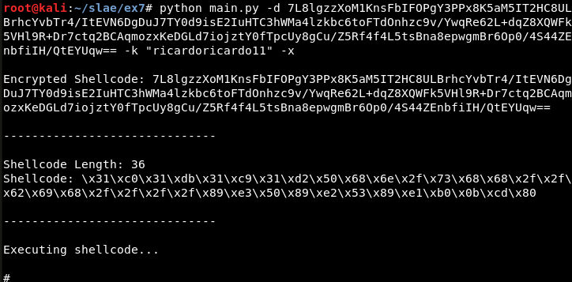

# Assignment #7: Custom crypter

- Create a custom crypter like the one shown in the "crypters" video

- Free to use any existing encryption schema

- Can use any programming language


---------------------------------------------------

## Motivation

The motivation in this last assignment is similar to the one in the Custom encoder and Polymorphic code, to be able to bypass AVs and execute the desired shellcode. In this assignment the encryption chosen is AES-CBC and the programming language is Python after finding out how to execute the shellcode with it and create a binary file from the Python code.


## Usage

- '-k', '--aes_key': *AES key used*.

- '-e', '--encrypt': *Shellcode to encrypt*.

- '-d', '--decrypt': *Encrypted shellcode to decrypt*.

- '-x', '--execute': *Execute the shellcode after decrypting or not*.


### Encryption

```bash
python main.py -e "\x31\xc0\x31\xdb\x31\xc9\x31\xd2\x50\x68\x6e\x2f\x73\x68\x68\x2f\x2f\x62\x69\x68\x2f\x2f\x2f\x2f\x89\xe3\x50\x89\xe2\x53\x89\xe1\xb0\x0b\xcd" -k "ricardoricardo11"
```




### Decryption

```bash
python main.py -d 7L8lgzzXoM1KnsFbIFOPgY3PPx8K5aM5IT2HC8ULBrhcYvbTr4/ItEVN6DgDuJ7TY0d9isE2IuHTC3hWMa4lzkbc6toFTdOnhzc9v/YwqRe62L+dqZ8XQWFk5VHl9R+Dr7ctq2BCAqmozxKeDGLd7iojztY0fTpcUy8gCu/Z5Rf4f4L5tsBna8epwgmBr6Op0/4S44ZEnbfiIH/QtEYUqw== -k "ricardoricardo11"  -x
```




---------------------------------------------------


## Note

This blog post has been created for completing the requirements of the SecurityTube Linux Assembly Expert certification: https://www.pentesteracademy.com/course?id=3

Student ID: SLAE - 1433
