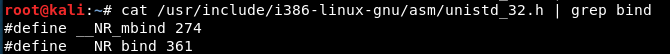
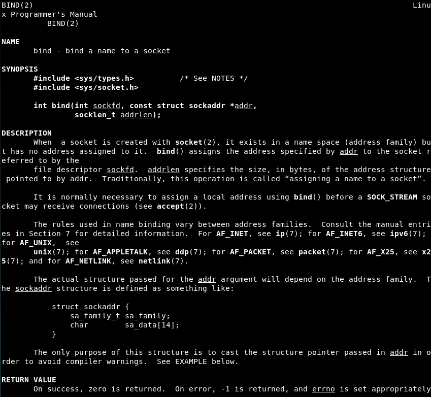
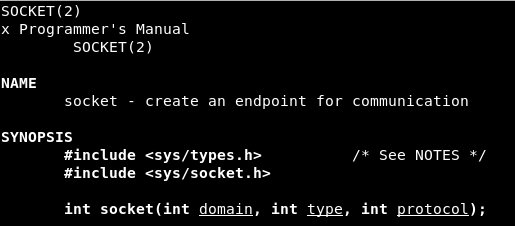

# Exercise 1



man bind



man socket




Url: http://man7.org/linux/man-pages/man2/socket.2.html 


```
msfvenom -p linux/x86/shell_bind_tcp --platform=Linux -a x86 -f raw LPORT=8888 | ./sctest -vvv -Ss 10000 -G bindshell.dot
```

```
sh libemu.sh "msfvenom -p linux/x86/shell_bind_tcp --platform=Linux -a x86 -f raw LPORT=8888" bindshell | tee libemu_res/libemu_res.txt
```

```
cat /usr/include/i386-linux-gnu/asm/unistd_32.h 
```

```
printf "%x\n" 363
```

