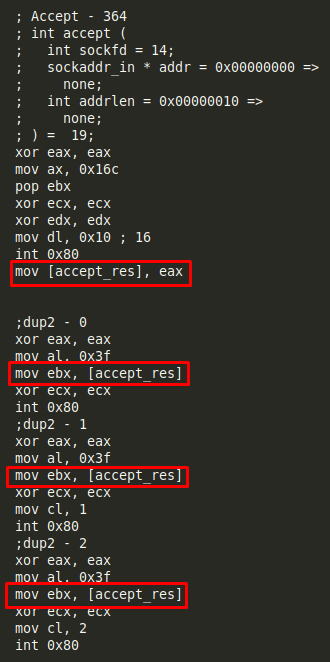

# Exercise 1

## Usage

```
python3 wrapper.py $PORT
```


## Steps

Get "sctest" result (also using *libemu.sh* script in "scripts/" folder):
```
msfvenom -p linux/x86/shell_bind_tcp --platform=Linux -a x86 -f raw LPORT=8888 | ./sctest -vvv -Ss 10000 -G bindshell.dot

-------------------------------------

sh libemu.sh "msfvenom -p linux/x86/shell_bind_tcp --platform=Linux -a x86 -f raw LPORT=8888" bindshell | tee libemu_res/libemu_res.txt
```

Get hexadecimal values for every syscall (also using *syscallhex.sh* script in **scripts/** folder):
```
cat /usr/include/i386-linux-gnu/asm/unistd_32.h | listen

printf "%x\n" 363

-------------------------------------

sh syscallhex.sh listen
```


## Deleting NOPs

[socket] generates NOPs:


It is possible to solve it using the stack:


[accept_res] generates NOPs:



It is possible to solve it using the stack:


There is not NOPs anymore:


## Creating Python wrapper 

Get the shellcode:


Change the "\" to "\\":


Detect where the port (8888 or 0x22b8 in hexadecimal) is being used:


Substitute that value in the original shellcode for a variable:


## Useful links
```
http://man7.org/linux/man-pages/man2/socket.2.html
https://stackoverflow.com/questions/19850082/using-nasm-and-tcp-sockets
http://man7.org/linux/man-pages/man2/socket.2.html
https://rosettacode.org/wiki/Sockets
http://www6.uniovi.es/cscene/CS5/CS5-05.html
https://stackoverflow.com/questions/48773917/why-creating-a-remote-shell-using-execve-doesnt-overwrite-file-descriptors-and
```
