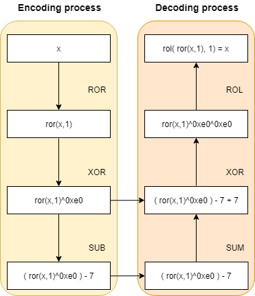

# Exercise 4

## Usage

```
python test.py  && ./shellcode && ./shellcode
```


## Custom encoding

For this exercise, we start from the "Insertion" and "NOP" encoders from the course. Two new ideas are added:

- There will be two operations to encode every opcode: a ROR operation with the value 8 and a substraction with the value 7. Thereby, the decoding function will first add the value 7 and then do the ROL operation with the value 8.

- There will be fake opcodes inserted between every correct opcode as in the "Insertion" encoder. However, in this case the values will be randomized. The value to verify the shellcode has finished will be calculated in the Python script, a not used value between the minimum and the maximum of the opcode values of the shellcode. For example, in this case the value is "\xe0".

