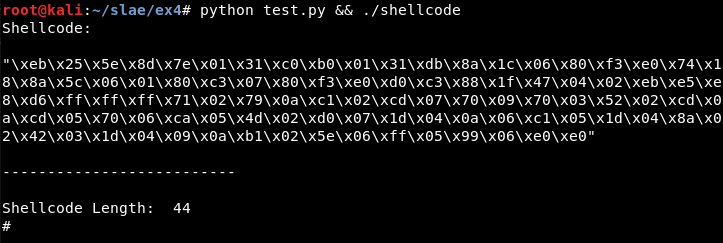

# Exercise 4

## Test/usage

For this assignment, a Python script has been created which generates the shellcode, updates and compiles the *decoder.nasm* file and updates and compiles the *shellcode.c* file, generating the final executable:

```
python test.py  && ./shellcode
```




## Custom encoding

For this exercise, we start from the "Insertion" and "NOP" encoders from the course, update both ideas and create a single encoding algorithm.


### Idea 1: Opcodes encoding

There will be 3 operations to encode every opcode: a ROR operation with the value 1 ("rotating" the bits once towards the "right"), a XOR with *0xe0* and a substraction with the value 7. 

Thereby, the decoding function will first add the value 7, then XOR the value with *0xe0* and finally do the ROL operation with the value 1 ("rotating" the bits once towards the "left").

This can be understood better with the next picture:


### Idea 2: Random inserted opcodes

There will be fake opcodes inserted between every correct opcode as in the "Insertion" encoder but, in this case, the values will be randomized. This will cause that the shellcode is different every time the program is run. 


The value to verify the shellcode has finished will be calculated in the Python script, a not used value between the minimum and the maximum of the opcode values of the shellcode. For example, in this case the value is "\xe0".


